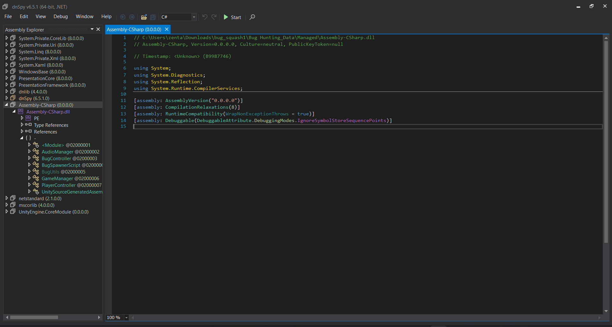
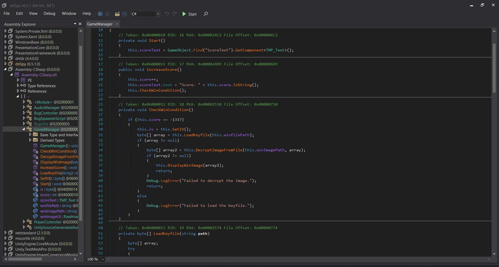
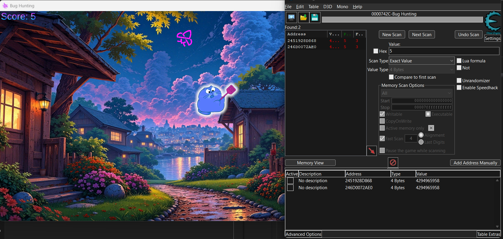
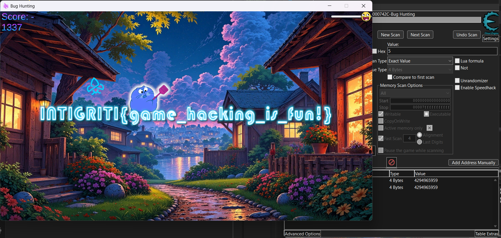

## Scenario

> Squash those bugs!

By CryptoCat

## Solution

The game is a simple game where you have to kill the bugs by clicking on them. The game is written in Unity and you can find the `assembly-csharp.dll` file in the `Bug Hunting_Data/Managed` directory.

We can use dnSpy to decompile the `assembly-csharp.dll` file.



Check the `GameManager` class there is a function called `IncreaseScore` and `CheckWinCondition` which checks if the score is equal to `-1337` then it will load the keyfile and decrypt the image.

```cs
// Token: 0x06000011 RID: 17 RVA: 0x000024D9 File Offset: 0x000006D9
public void IncreaseScore()
{
    this.score++;
    this.scoreText.text = "Score: " + this.score.ToString();
    this.CheckWinCondition();
}

// Token: 0x06000012 RID: 18 RVA: 0x00002510 File Offset: 0x00000710
private void CheckWinCondition()
{
    if (this.score == -1337)
    {
        this.iv = this.SetIV();
        byte[] array = this.LoadKeyfile(this.winfilePath);
        if (array != null)
        {
            byte[] array2 = this.DecryptImageFromFile(this.winImagePath, array);
            if (array2 != null)
            {
                this.DisplayWinImage(array2);
                return;
            }
            Debug.LogError("Failed to decrypt the image.");
            return;
        }
        else
        {
            Debug.LogError("Failed to load the keyfile.");
        }
    }
}
```



You can see that the score is set to `-1338` using Cheat Engine and then the image will be decrypted. You know how to use Cheat Engine right? right? right?



After killing one bug the score will be increased by 1 and the image will be decrypted.



But.. there is also another solution to decrypt the image without increasing the score. We can just decrypt the image!!

Check the `GameManager` class there is a function called `SetIV` which sets the IV for the decryption. The IV is XORed with `66` and then returned.

```cs
private byte[] SetIV()
{
    byte[] array = new byte[]
    {
        9, 59, 202, 213, 13, 62, 108, 125, 224, 15,
        10, 159, 13, 51, 70, 1
    };
    byte b = 66;
    for (int i = 0; i < array.Length; i++)
    {
        byte[] array2 = array;
        int num = i;
        array2[num] ^= b;
    }
    return array;
}
```

These files are likely used for encryption and decryption purposes within the game, where `win.enc` is the encrypted file and `win.key` is the key used to decrypt it. The path to the files is `bug_squash1\Bug Hunting_Data\StreamingAssets\MeshText`.

```cs
// Token: 0x04000012 RID: 18
public string winImagePath = "MeshText/win.enc";

// Token: 0x04000013 RID: 19
public string winfilePath = "MeshText/win.key";
```

We can write a script to decrypt the image.

```py
from Crypto.Cipher import AES

def get_iv():
    iv = bytearray([
        9, 59, 202, 213, 13, 62, 108, 125, 224, 15,
        10, 159, 13, 51, 70, 1
    ])
    
    b = 66
    for i in range(len(iv)):
        iv[i] ^= b

    return bytes(iv)

def decrypt_aes_ccb(ciphertext, key):
    iv = get_iv()
    aes = AES.new(key, AES.MODE_CBC, iv)
    return aes.decrypt(ciphertext)

key = open('./Bug Hunting_Data/StreamingAssets/MeshText/win.key', 'rb').read()
ciphertext = open('./Bug Hunting_Data/StreamingAssets/MeshText/win.enc', 'rb').read()

image = decrypt_aes_ccb(ciphertext, key)
open('flag.png', 'wb').write(image)
```

After running the script we will get the flag.


