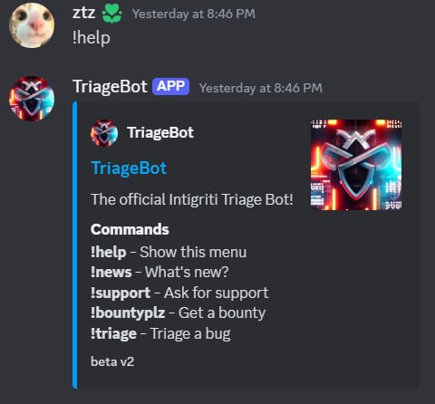
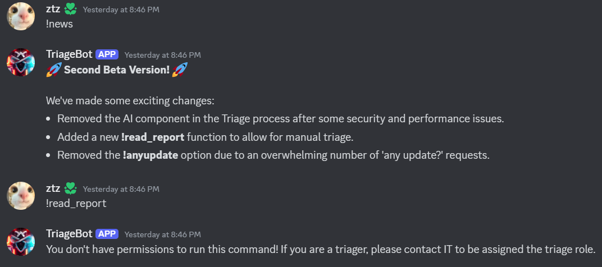
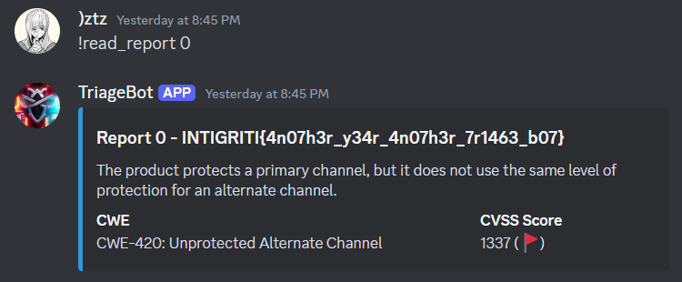

## Scenario

> Check out our new and improved Triage Bot!
>
> https://go.intigriti.com/discord

By 0xM4hm0ud & CryptoCat

## Solution

The challenge description mentions a Discord bot, so I joined the Discord server and found the bot in the `#🤖┃triage-bot` channel. 

The bot prefix was `!` and the help command was `!help`. The help command showed the available commands.

After checking all the commands, I found the interesting command `!news`. There is new command added in the bot `!read_report`. I tried to use the command `!read_report` but it was not working. The bot said that I need to be assigned the role `triage` to use the command.

So I invited the bot to my server and assigned the role `triage` to myself. After that, I used the command `!read_report 0` and the bot gave me the flag.

