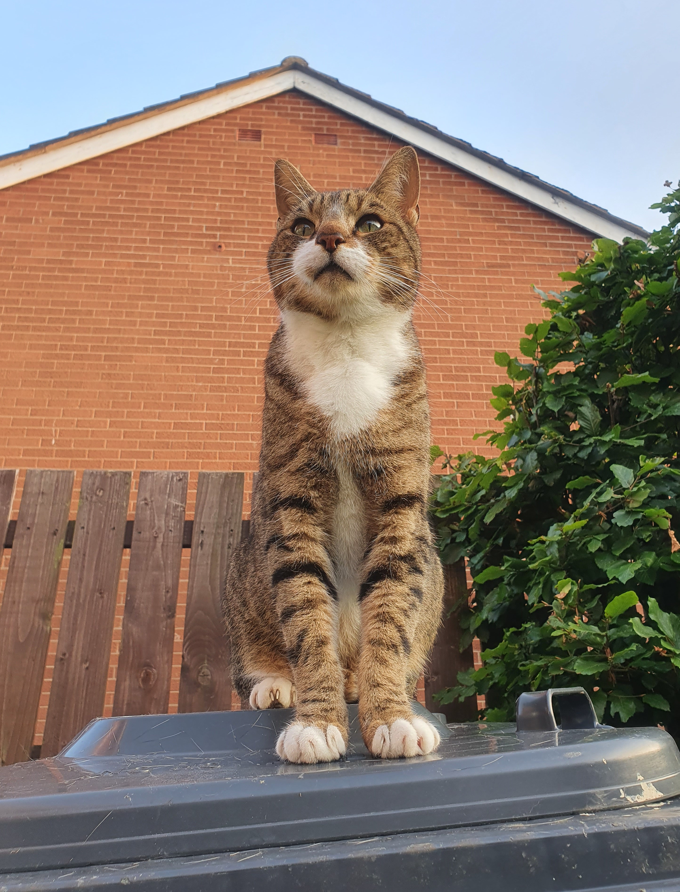
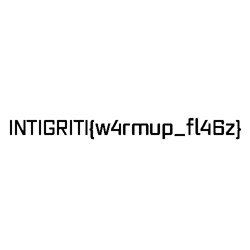

## Scenario

> Barely hidden tbh..

By CryptoCat

## Solution

The challenge given `meow.jpg` file. 



Running `strings` command on the image file gives interesting output.

```
YoullNeverGetThis719482
flag.pngUT
```

We can extract the flag by extracting the `flag.png` file from the image. We can use `binwalk` to extract the file.

```sh
binwalk meow.jpg
```

The output will be like this.

```
-----------------------------------------------------------------------------------------------------------------------------------------------------------------------
DECIMAL                            HEXADECIMAL                        DESCRIPTION
-----------------------------------------------------------------------------------------------------------------------------------------------------------------------
2144878                            0x20BA6E                           ZIP archive, file count: 1, total size: 2120 bytes
-----------------------------------------------------------------------------------------------------------------------------------------------------------------------
```

To extract the zip file, we can use the `dd` command.

```sh
dd if=meow.jpg of=2144878.zip bs=1 skip=2144878 count=2120
```

Extract the zip file using the password `YoullNeverGetThis719482` we got from the `strings` command.

```sh
unzip -P YoullNeverGetThis719482 2144878.zip
```

You will get the `flag.png` file. But the flag is not visible in the image.


Use https://aperisolve.fr/ to see the hidden text in the image.


