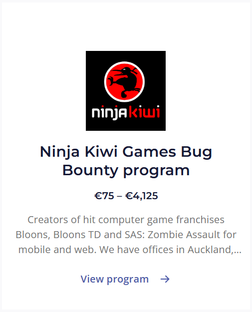

## Scenario

> I was working on a bug bounty program the other day but I completely forgot the name!! I guess that will teach me not to use emoji notation in future 😩 Anyway, if you could help me find it again, I'd really appreciate it! Here's my notes..
>
> TODO: find lots of 😎🐛 on 🥷🥝🎮
>
> `Hint: flag format = INTIGRITI{company_name}`
>
> [https://go.intigriti.com/programs](https://go.intigriti.com/programs)

By CryptoCat

## Solution

The hint given in the challenge is `TODO: find lots of 😎🐛 on 🥷🥝🎮`. The emojis are representing the words `cool`, `bugs`, `ninja`, `kiwi`, and `games`. The company name is `ninja kiwi games`. So the flag is `INTIGRITI{ninja_kiwi_games}`.

