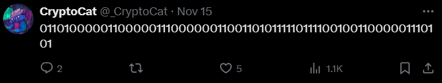
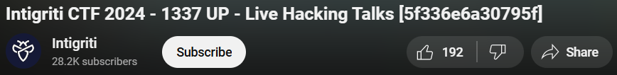
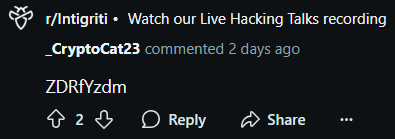

## Scenario

> Have a look around our socials, maybe you'll find some flags! Don't forget to hit follow while you're there 🥺
>
> Flag format: `INTIGRITI{Twitter+YouTube+Reddit}`
>
> [https://linktr.ee/hackwithintigriti](https://linktr.ee/hackwithintigriti)

By CryptoCat

## Solution

The challenge provides a link to the Intigriti Linktree page, which contains links to the Intigriti Twitter, YouTube, and Reddit accounts. The objective is to search through these social media platforms to find the flags.

After visiting the Twitter, YouTube, and Reddit accounts, I found the following flags from CryptoCat's comments.

### Twitter

In twitter we found CryptoCat's comment in one of the Intigriti's tweets:

```
0110100000110000011100000011001101011111011110010011000001110101
```

After decoding the binary data, we get the partial flag:

```
h0p3_y0u
```

https://x.com/_CryptoCat/status/1857392992182513941



### YouTube

In YouTube we found the flag in the video title:

```
5f336e6a30795f
```

After decoding the hex data, we get the partial flag:

```
_3nj0y_
```

https://www.youtube.com/watch?v=BKXfrNwrcqQ



### Reddit

In Reddit we found the flag in one of the CryptoCat's comments:

```
ZDRfYzdm
```

After decoding the base64 data, we get the partial flag:

```
d4_c7f
```

https://www.reddit.com/r/Intigriti/comments/1grbmj3/comment/lx90xt6/


