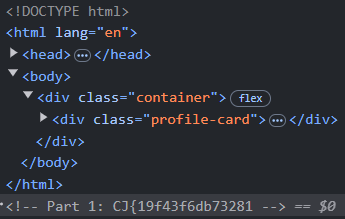
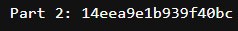
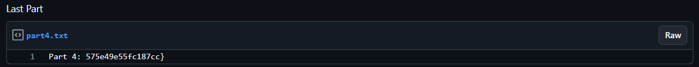

## Scenario

> A hacker known as "Ed" has crafted an elaborate online persona, leaving traces scattered across their personal webpage and various digital platforms. Your mission is to investigate and find the traces.

By farisv

## Solution

The traces are started from Ed Salmin's personal webpage. The first part of the flag is hidden in source code of the webpage.

Inspecting the source code, we can find the first part of the flag. The flag is `CJ{19f43f6db73281`.

After that, we can find the second part of the flag in his facebook profile. Where he posted a image about his current project. Where there is a terminal that has a `pastebin` link in it but the link is missing one letter, here we can use the bruteforce method to find the missing letter.

The link that is missing one letter is https://pastebin.com/raw/a9v29gi. And after some manual bruteforce I found the missing letter which is the letter `e` and the full link is https://pastebin.com/raw/a9v29gie. The second part of the flag is `14eea9e1b939f40bc`.

I realized that the personal of "Ed" is hosted on github so I tried to find the github of "Ed" with some guesses and luckily I got it with the username `edsalmin`. You can also search by just pinging the website and we will get a url like this `edsalmin.github.io`.

The third part of the flag is hidden in the github profile of "Ed". In one of the commit history from the repository, we can find the third part of the flag. The flag is `453fdb0b69a4e0006`.

The last part of the flag is hidden in the gist of "Ed". The last part of the flag is `575e49e55fc187cc`.

