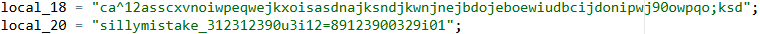
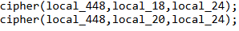
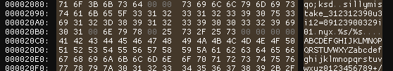

## Scenario

> My files got encrypted after pirating a game, can you recover it?
>
> **WARNING**: Run tartarus with caution.

By Off5E7

## Solution

The challenge provides a file named `tartarus` and `flag.txt`. The `tartarus` file is an ELF executable. Running the executable will download another ELF executable named `nyx`. The `nyx` executable is a ransomware that encrypts the files in the current directory. The ransomware will encrypt the files using the `XOR` operation with a key XOR encryption. The cipher text with an extra string at the end `"waifuku_ada_5"` and encode the cipher text using base64.

The encryption operation will be performed twice. The first encryption will use the key `ca^12asscxvnoiwpeqwejkxoisasdnajksndjkwnjnejbdojeboewiudbcijdonipwj90owpqo;ksd` and the second encryption will use the key `sillymistake_312312390u3i12=89123900329i01`. The ransomware will then encode the cipher text using base64.



But... the ransomware has a bug. The ransomware will use the first key length to encrypt the second key. This will cause the second key to have garbage values after the length goes beyond the length of the second key.



Because of this bug, we need to figure out what the string is after the second key length goes beyond the length of the second key. We can see that the second key is `sillymistake_312312390u3i12=89123900329i01`. The garbage values are `nyx\0%s/%s\0\0\0\0ABCDEFGHIJKLMNOPQRSTUV`.



So the first key is `ca^12asscxvnoiwpeqwejkxoisasdnajksndjkwnjnejbdojeboewiudbcijdonipwj90owpqo;ksd` and the second key is `sillymistake_312312390u3i12=89123900329i01\0nyx\0%s/%s\0\0\0\0ABCDEFGHIJKLMNOPQRSTUV`.

We can write a script to decrypt the file using the two keys and remove the extra string at the end of the cipher text.

```py
import base64

def decrypt(data, key, length):
    decoded_data = base64.b64decode(data)
    decoded_data = decoded_data[:-13] # Remove the "waifuku_ada_5" string

    decrypted_data = bytearray()
    for i in range(len(decoded_data)):
        decrypted_data.append(decoded_data[i] ^ ord(key[i % length]))
    return decrypted_data

def decode_file(filepath, key1, key2):
    with open(filepath, "rb") as f:
        encrypted_data = f.read()

    decrypted_data = decrypt(encrypted_data, key2, len(key1))
    decrypted_data = decrypt(decrypted_data, key1, len(key1))
    return decrypted_data

key1 = "ca^12asscxvnoiwpeqwejkxoisasdnajksndjkwnjnejbdojeboewiudbcijdonipwj90owpqo;ksd"
key2 = "sillymistake_312312390u3i12=89123900329i01\0nyx\0%s/%s\0\0\0\0ABCDEFGHIJKLMNOPQRSTUV"

decrypted_content = decode_file("flag.txt", key1, key2)
print(decrypted_content.decode().strip())
```
