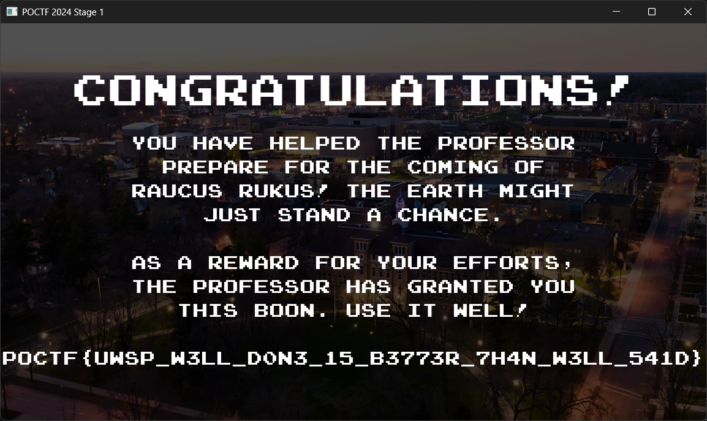

## Scenario

> The Professor needs to power up before the evil Raucus Ruckus comes to Earth with his army of slimeballs! Help The Professor fill up his magic meter to prepare for the final confrontation with the forces of evil!
>
> The Professor needs 10,000 power points or Earth is doomed, but be careful as his magic meter will slowly drain without your help! Don't worry - you can save your progress and come back to finish later!

## Solution

Just edit the value of the power points in the save file `C:\Users\<username>\AppData\Roaming\Godot\app_userdata\POCTF 2024 Stage 1\pointerclicker.save` to 10000.

