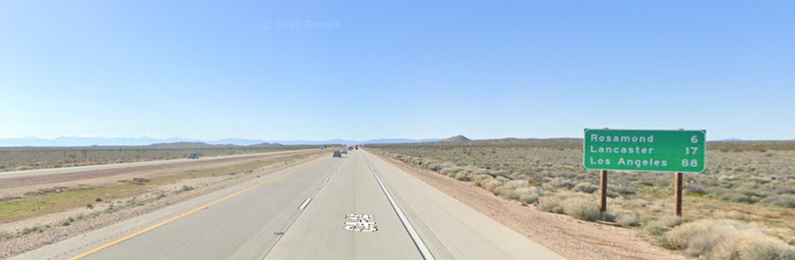

## Scenario

> The Professor has uncovered a critical piece of evidence: a dashcam photo retrieved from a hostile subject’s car, suspected of planning an infiltration at a nearby military installation. Your task is to utilize OSINT skills to stop this threat before it's too late.
>
> Analyze the **dashcam image** to determine the exact coordinates where it was taken. Identify the **nearest military installation** to this location . Find the distance **by road** (in miles) from the exact coordinates of the dashcam image to the military installation. Round off the mile count to the nearest whole number.
>
> Flag format: QUESTCON{<Name of airforce base>-<rounded off mile count>} The name should be one word and lowercase

## Solution



The image is named `California_dreamin`. The image shows a road sign with the text:

```
Rosamond 6 miles
Lancaster 17 miles
Los Angeles 88 miles
```

When we search the text `Rosamond 6 miles` on Google Maps, we find the location `34.8642, -118.1635`. The location is in Rosamond, California, USA. The nearest military installation to this location is `Edwards Air Force Base`.

The distance by road (in miles) from the exact coordinates of the dashcam image to the military installation is `23` miles.

## Flag

`QUESTCON{edwards-23}`
