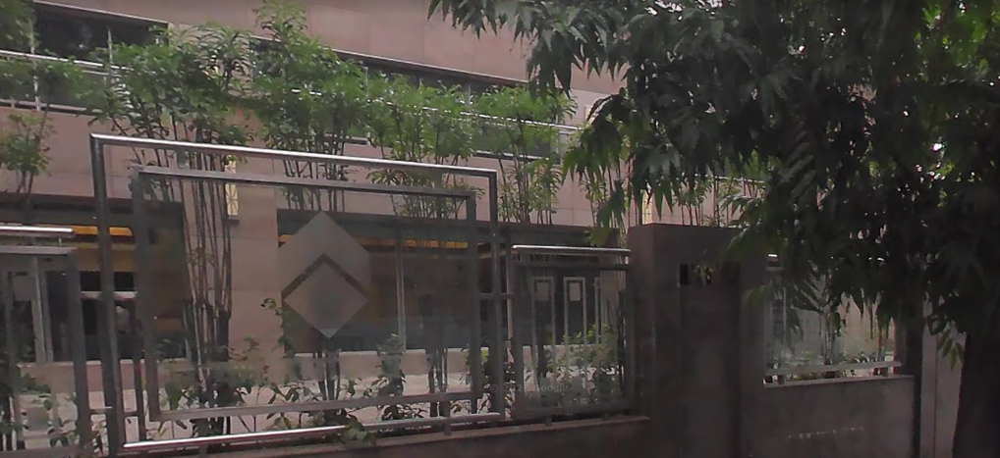

## Scenario

> Professor has retireved this image which was taken at the time and at the very place of a cyberattack from the dashcam of our suspect's car. Find the organization(1 word) that was attacked and also figure out when. A big amount of money was stolen in this attack. The figure is XX crore rupees. Flag format: QUESTCON{name_of_organization-year_of_attack-XX}

## Solution



The image is named `dashcam_capture_20180811`. The image shows a dash cam capture and a date `20180811`. The date is in the format `YYYYMMDD`. The date is `2018-08-11`.

When we use `exiftool` to view the metadata of the image, we find the following information:

```
GPS Latitude                    : 18 deg 32' 25.56" N
GPS Longitude                   : 73 deg 49' 56.34" E
GPS Position                    : 18 deg 32' 25.56" N, 73 deg 49' 56.34" E
```

The GPS coordinates are `18.540433, 73.832317`. We can use these coordinates to find the location of the image. The coordinates are in `Pune, Maharashtra, India`. The fish is a symbol of the `Phishing` attack. The organization that was attacked is `Cosmos Bank`. The year of the attack is `2018`. The amount of money stolen is `94` crore rupees.
