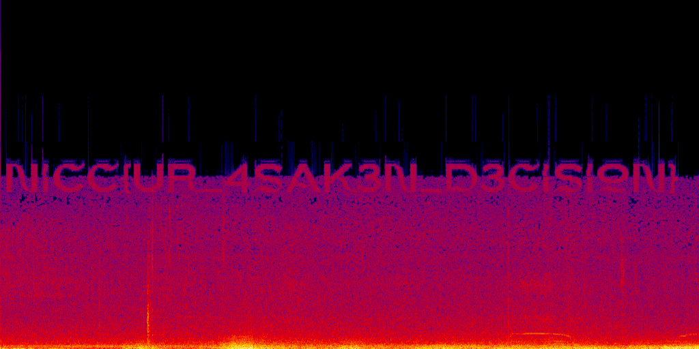

## Scenario

> Mary and Maya wanted to spend the rest of their Friday evening having more fun. They decided to go raundonauting, they set their intentions to paranormal and it sounds like they needed to end up hiding from what they found.

By Jolie

## Solution

The flag is hidden in the spectrogram of the audio file. You can view the flag by viewing the spectrogram of the audio file. You can use `ffmpeg` to generate the spectrogram image.

```sh
ffmpeg -i evidence.mp3 -lavfi showspectrumpic=s=1024x512:legend=disabled output.png
```


