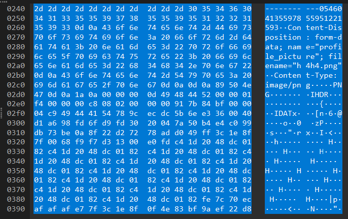
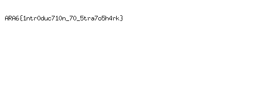

## Scenario

> My naughty junior dev do something weird

By pujoganteng

## Solution

So they give us a **scap** file, let's open it with **Wireshark**. After opening the file, we can see that there are a lot of **sysdig** packets. Sort the packets by length and we can see that there is a packet with a **PNG** header. 

Copy the packet bytes and save it as a PNG file. Open the PNG file and we can see the flag.

