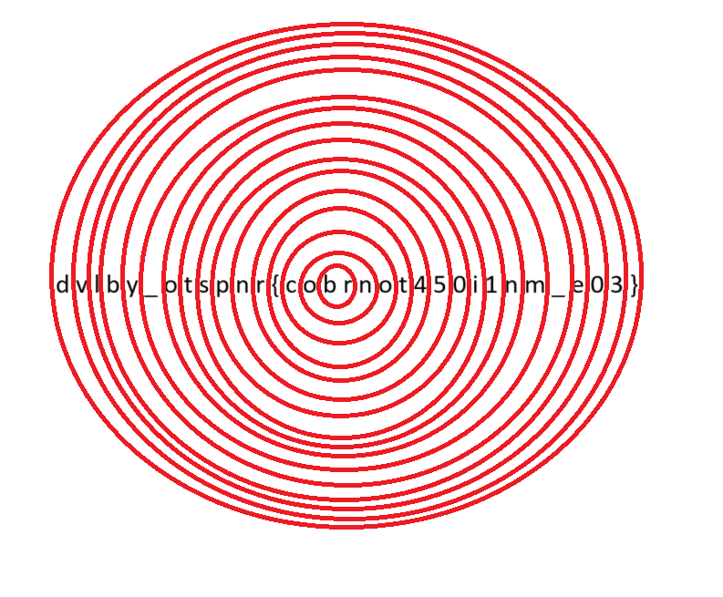

> Someone's been spreading weird messages around campus...
>
> I keep seeing posters that have random characters on them, what could they mean?
>
> Here's one of them: `dvlby_otspnr{cobrnot450i1nm_e03}`

---

So there is a hint in the title that it is related to *Circular*. After looking around and I found the pattern is like this:

