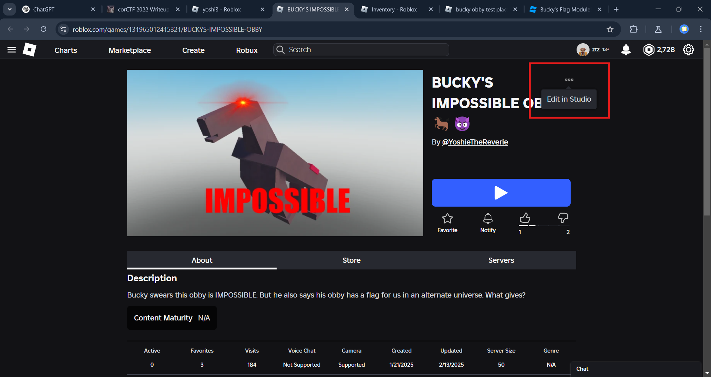
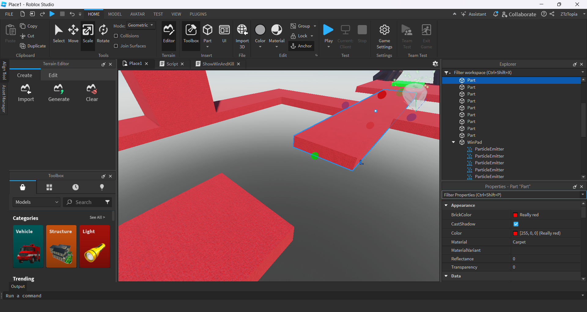
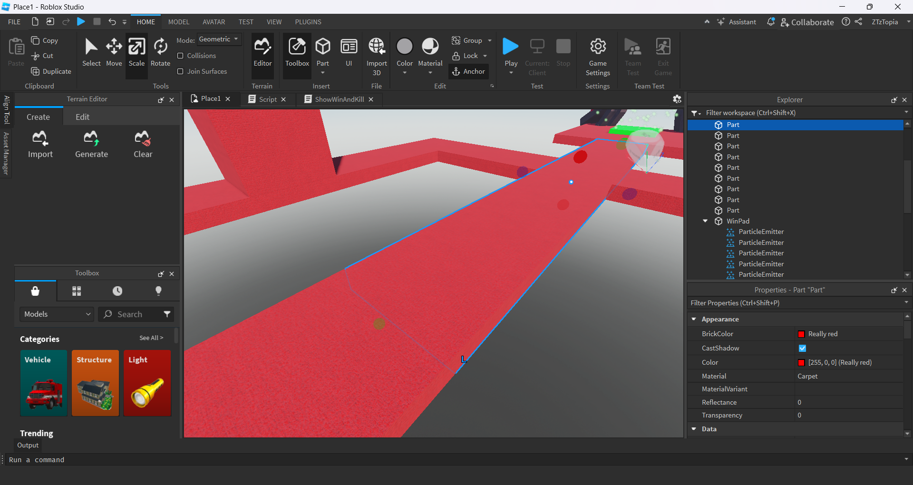
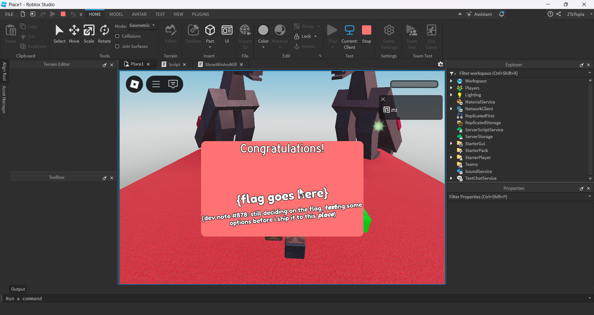
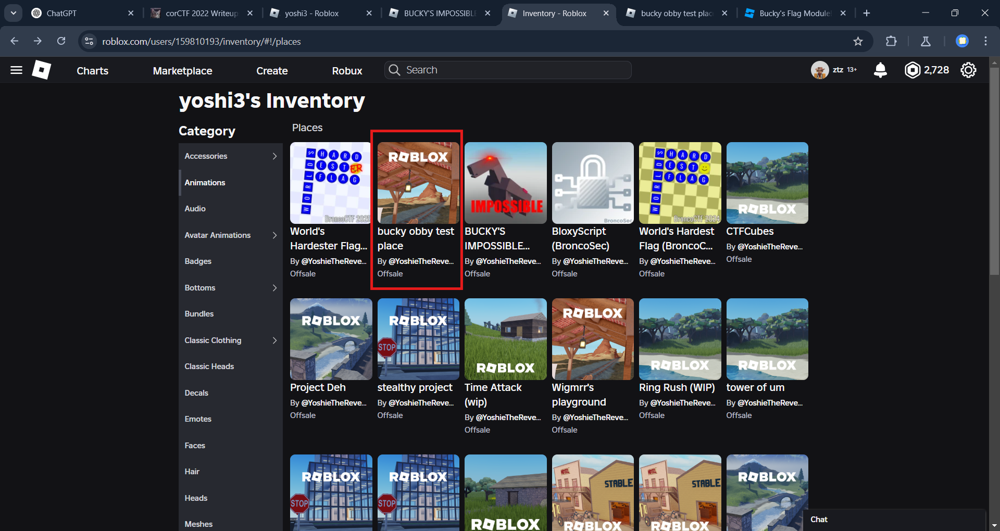
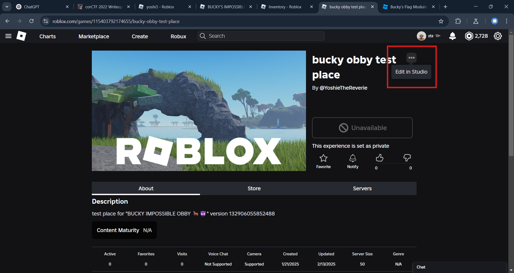
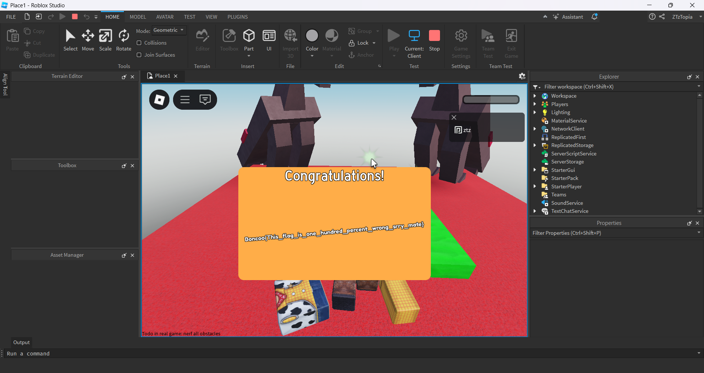
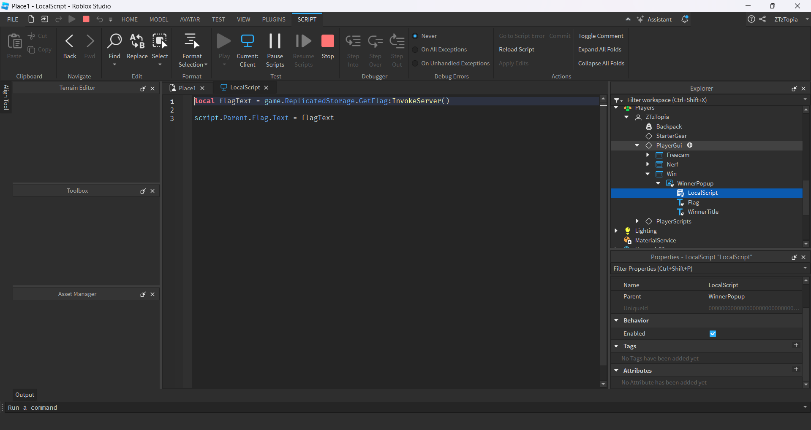
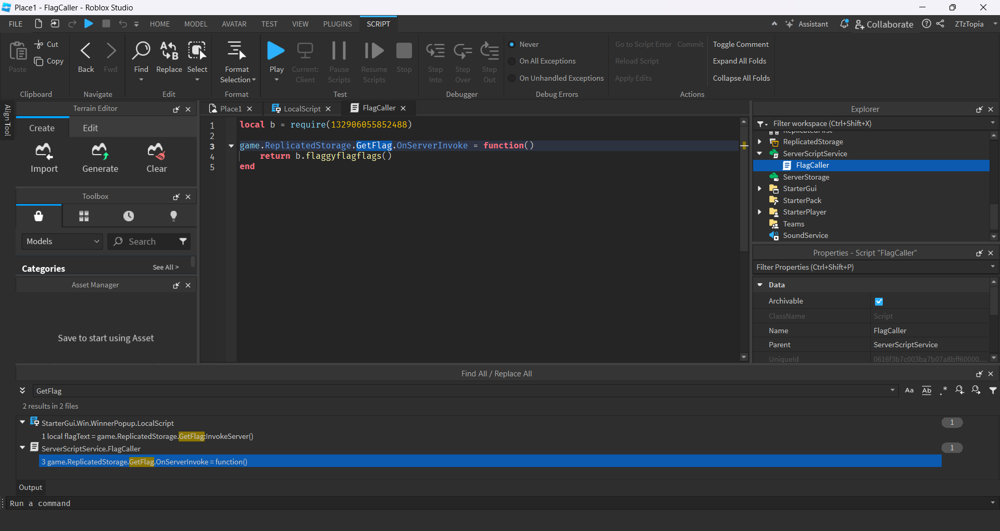
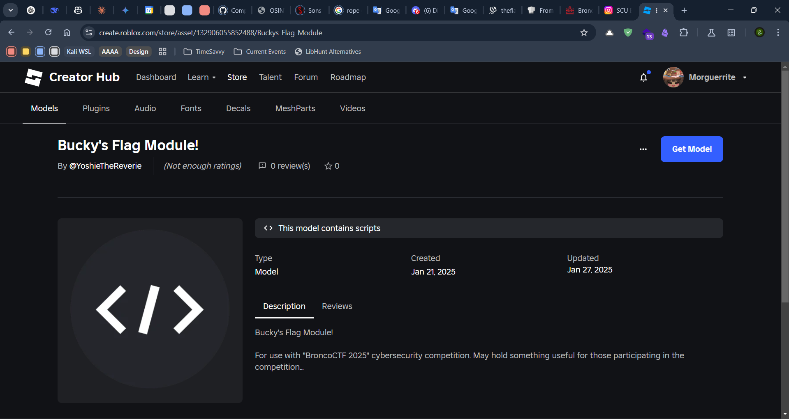

> Bucky swears this obby (obstacle course) is IMPOSSIBLE. But he also says his obby has a flag for us in an alternate universe. What gives?
> [https://www.roblox.com/games/131965012415321/BUCKYS-IMPOSSIBLE-OBBY](https://www.roblox.com/games/131965012415321/BUCKYS-IMPOSSIBLE-OBBY)
>
> Note: Roblox Studio (and a Roblox account) is required for this challenge.

By yoshie878

---

Yeay a **Robloks** challenge! I love playing with someone until midnight :)). There is a game called **BUCKY'S IMPOSSIBLE OBBY**. Where you won't be able to step on the finish checkpoint unless you use an exploit.

Because the note said **Roblox Studio** so I immediately went back to the game page and tried to see if there was an **Edit in Studio** option. Turns out there was!



After successfully opening **Roblox Studio** I tried to make the path easier by scaling the object so that there are no holes and can go straight to the finish. After succeeding I tried to play the game and managed to get to the finish.




But when you get to the finish line, there's only a placeholder that says **{flag goes here}**.



And there are dev notes which say: (dev note #878: still deciding on the flag, **test**ing some options before i ship it to this **place**) if you look closely there are the words **test** and **place** in bold. So let's just look for **test place** in the inventory of the game maker.



It turns out there is and it can be edited with **Roblox Studio**.




And another troll from the game maker. We can see the lua code used to create the game. It turns out that the flag that appears after finish is invoked from the server using `InvokeServer`.




We get that after the server receives the invoke from the client, it will return a flag that comes from a module. We can find that module by using the url `https://create.roblox.com/store/asset/<id>`.



After adding the module to our inventory we can see the lua code used to create the flag.

```lua
local buckysSuperAmazingFlagModule = {}
function buckysSuperAmazingFlagModule.flaggyflagflags() 

	-- hey you!
	-- yeah you!
	-- stop snooping around!
	-- there's nothing to see here! 

	-- ( - v - ) . z Z


	-- ( o - o )

	-- i'm his assistant!
	-- let's take a tour of this amazing module
	-- while he's asleep.

	-- important data!
	local data = {
		var_0107 = "_is_one_",
		var_0113 = "percent_",
		var_0103 = "his_flag",
		var_0011 = "11_w0w!}",
		var_0127 = "wrong_sr",
		var_0109 = "hundred_",
		var_0005 = "p0551bl3",
		var_0003 = "0t_s0_1m",
		var_0101 = "Boncoo{T",
		var_0002 = "bronco{n",
		var_0007 = "_4ft3r_4",
		var_0131 = "ry_mate}",
	}	

	-- helper function
	local function ip(n)
		if n <= 1 then
			return false
		end
		for i = 2, math.sqrt(n) do
			if n % i == 0 then
				return false
			end
		end
		return true
	end
	-- helper function
	local ps = {}
	local n = 100
	local lim = 7
	while #ps < lim do
		if ip(n) then
			table.insert(ps, n)
		end
		n = n + 1
	end
	-- where the flag magic happens
	local flag = ""
	for i, p in pairs(ps) do
		flag = flag .. data["var_" .. string.format("%04d", tostring(p))]
	end

	-- and there you go!
	return flag
end
return buckysSuperAmazingFlagModule
```

By removing the variable used to troll us, we get the actual flag.

```lua
local data = {
    var_0011 = "11_w0w!}",
    var_0005 = "p0551bl3",
    var_0003 = "0t_s0_1m",
    var_0002 = "bronco{n",
    var_0007 = "_4ft3r_4",
}
```

We reorder the variables and get the actual flags.

```lua
local data = {
    var_0002 = "bronco{n",
    var_0003 = "0t_s0_1m",
    var_0005 = "p0551bl3",
    var_0007 = "_4ft3r_4",
    var_0011 = "11_w0w!}",
}
```
