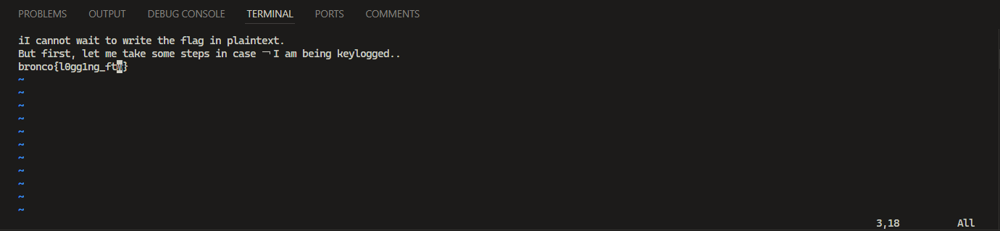

> We managed to get a keylogger on a notorious hacker's computer. 
>
> Our best analysts are pretty sure they type their password into a text file during this log segment, but we can't figure it out.
>
> Can you get us the flag from this?

By shwhale

---

We are given a log file `keys.log` that contains keypresses and releases. The log file contains lines like the following:

```
KeyRelease event, serial 18, synthetic NO, window 0x180000e, root 0x6c0, subw 0x0, time 36801639, (1314,474), root:(1322,554), state 0x0, keycode 50 (keysym 0xffe1), same_screen YES
KeyPress event, serial 18, synthetic NO, window 0x180000e, root 0x6c0, subw 0x0, time 36801639, (1314,474), root:(1322,554), state 0x0, keycode 50 (keysym 0xffe1), same_screen YES
KeyRelease event, serial 21, synthetic NO, window 0x180000e, root 0x6c0, subw 0x0, time 36801841, (1314,474), root:(1322,554), state 0x1, keycode 52 (keysym 0x3a), same_screen YES
KeyPress event, serial 21, synthetic NO, window 0x180000e, root 0x6c0, subw 0x0, time 36801841, (1314,474), root:(1322,554), state 0x1, keycode 52 (keysym 0x3a), same_screen YES
KeyRelease event, serial 21, synthetic NO, window 0x180000e, root 0x6c0, subw 0x0, time 36801908, (1314,474), root:(1322,554), state 0x1, keycode 50 (keysym 0xffe1), same_screen YES
KeyRelease event, serial 21, synthetic NO, window 0x180000e, root 0x6c0, subw 0x0, time 36801918, (1314,474), root:(1322,554), state 0x0, keycode 52 (keysym 0x3b), same_screen YES
KeyRelease event, serial 21, synthetic NO, window 0x180000e, root 0x6c0, subw 0x0, time 36802249, (1314,474), root:(1322,554), state 0x0, keycode 40 (keysym 0x65), same_screen YES
KeyPress event, serial 21, synthetic NO, window 0x180000e, root 0x6c0, subw 0x0, time 36802249, (1314,474), root:(1322,554), state 0x0, keycode 40 (keysym 0x65), same_screen YES
KeyRelease event, serial 21, synthetic NO, window 0x180000e, root 0x6c0, subw 0x0, time 36802332, (1314,474), root:(1322,554), state 0x0, keycode 40 (keysym 0x65), same_screen YES
KeyRelease event, serial 21, synthetic NO, window 0x180000e, root 0x6c0, subw 0x0, time 36802446, (1314,474), root:(1322,554), state 0x0, keycode 65 (keysym 0x20), same_screen YES
```

The log file contains keypresses and releases for various keys. The keysym value is the keysym value of the key that was pressed or released. We can extract the keysym value from the log file and convert it to a character to get the plaintext.

```py
import re

plaintext = []
shift_pressed = False

# Regex to extract keysym from the log line
keysym_regex = re.compile(r'keysym 0x([0-9a-fA-F]+)')

with open('keys.log', 'r') as file:
	for line in file:
		if 'KeyPress' in line or 'KeyRelease' in line:
			keysym_match = keysym_regex.search(line)
			if keysym_match:
				keysym = int(keysym_match.group(1), 16)

				if keysym == 0xffe1:
					if 'KeyPress' in line:
						shift_pressed = True
					elif 'KeyRelease' in line:
						shift_pressed = False
				elif keysym == 0xff0d:
					if 'KeyPress' in line:
						plaintext.append('\n')
				elif keysym == 0xff08:
					if 'KeyPress' in line:
						if plaintext:
							plaintext.pop()
				elif keysym == 0xff1b:
					if 'KeyPress' in line:
						plaintext.append('<Esc>')
				else:
					if 'KeyPress' in line:
						# Convert keysym to character
						try:
							char = chr(keysym)
							if shift_pressed:
								if char.isalpha():
									char = char.upper()
								else:
									plaintext.append('<Shift>')
							plaintext.append(char)
						except ValueError:
							pass

print(f'Plaintext: {"".join(plaintext)}')
```

Running the script on the provided `keys.log` file gives us the following plaintext:

```
Plaintext: <Shift>:e flag.txt
iI cannot wait to write the flag in plaintext.
But first, let me take some steps in case ￢I am being keylogged...<Esc>oasonethubkxxmloreucigqxlrcgmxlrcgmsneth xiexsuinthexsuebntixkxq ;aojeubs m<Esc>Te;aro<Esc>lvhhhx0Pldtclrollla<Shift>{<Esc>wwa<Shift>}<Esc><Shift>%hxhxhs<Esc>llllr0hxlllrglR1n<Esc>lxllRft<Esc>lllllrwhvTexllD<Shift>:s/m//g
3fga<Shift>_<Esc>twx￢:wq
￫
```

The hacker tried to write flags in `flag.txt` but he tried to avoid keylogger by writing flags in a different way. Notice that some of the commands executed are `:e flag.txt` which means open the `flag.txt` file and `:s/m//g` which means delete all `m` characters from the file. So most likely this biggest hacker is using `vim` to write the flags. We can read the flags back in the same way as the hacker did.


