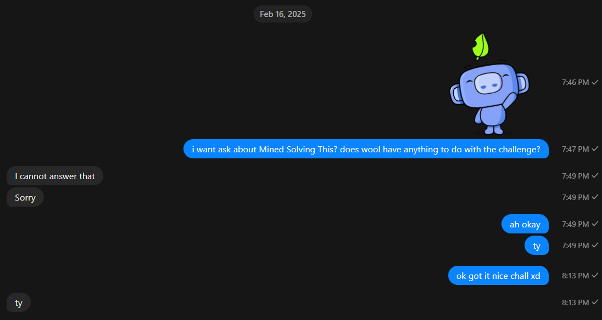

> I used to think Minecraft was just a silly game. I woold play it for hours and accomplish nothing. Making this challenge gave me perspective though!

> Note: You do not need a copy of Minecraft for this challenge

By shwhale

---

So this challenge is a **Minecraft** map. Downloaded the map and opened it in **Minecraft**. Open the map in **Minecraft** and we will be spawned in a far place.

At the beginning we will be at coordinates `1000 ~ 1000`, so we can teleporte to coordinates `0 ~ 0` with the command `/tp 0 0 0`. After that looked around and found a structure. Because there were no more clues, I tried to open the inventory and see if there were any clues there. And it turned out there were clues there.

After asking the problem setter, and he couldn't answer it was certain that `wool` was a clue. And it turned out to be true after explored the structure, it turned out that there were several colored `wool` blocks after standing on the `wool` and looking around, something would happen! namely the `diamond` block will show a letter pattern. And after we collect all the letter patterns, we will get a flag.

.png>) .png>) .png>) .png>) .png>) .png>) .png>) .png>) .png>) .png>) .png>) .png>) .png>) .png>) 

By matching the pattern with the `wool` order in the inventory, we will get the flag.
