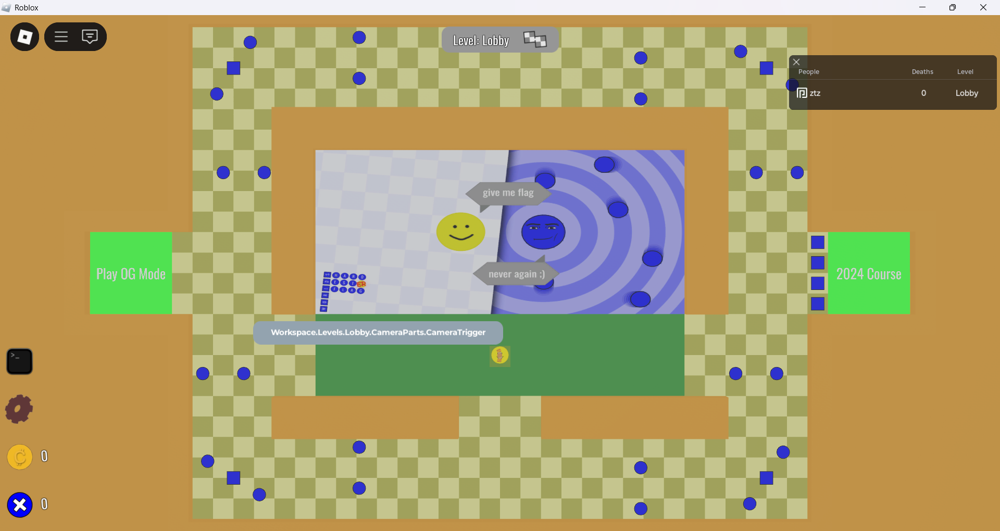
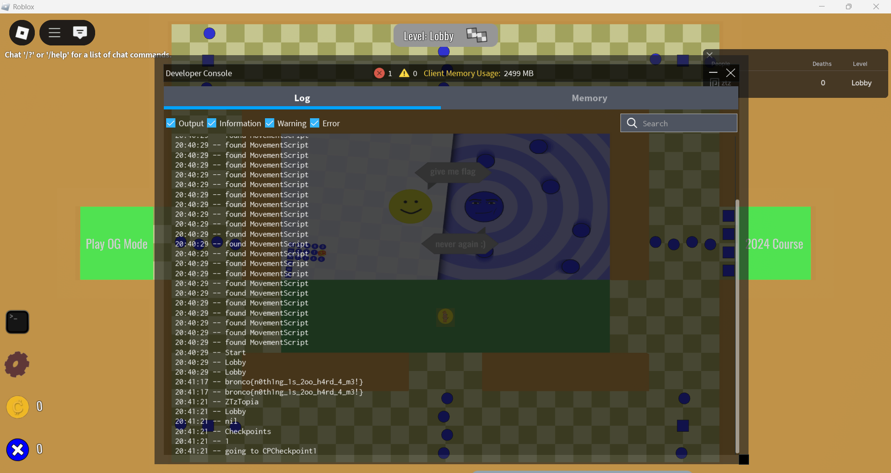
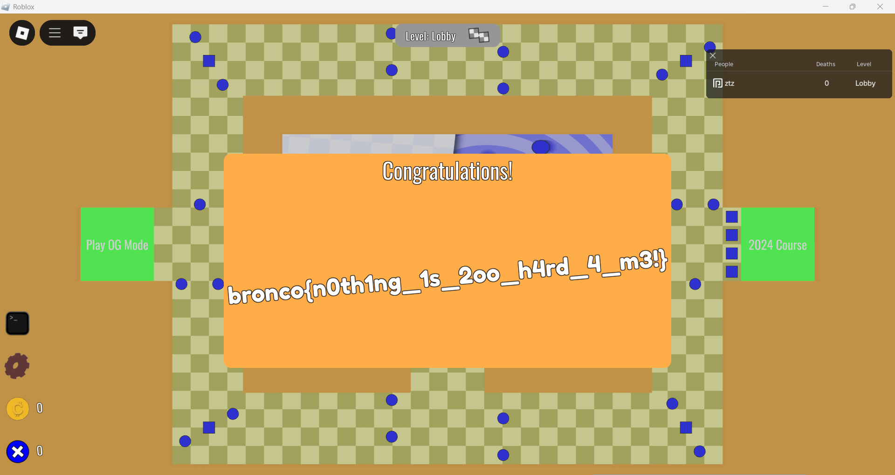

> Hey. It's me, Mr. Dehnemy. Remember me from last year?
>
> I have a new challenge for you. I present to you, the WORLD'S HARDEST(ER) FLAG!!
>
> Your tactics from last year will not work. YOU WILL NOT GET MY FLAG!!!!!!!!!!!!!
>
> [https://www.roblox.com/games/97958089823595/Worlds-Hardester-Flag](https://www.roblox.com/games/97958089823595/Worlds-Hardester-Flag)
>
> Note 1: Roblox Player (and a Roblox account) is required for this challenge.
>
> Note 2: If you load the game and get stuck on a blank colored screen, reset your character. Keep resetting your character if the screen keeps on being blank

By yoshie878

---

The game is a **Roblox** game. The objective is to get the flag. There are two paths to get the flag. The first path is to go through old levels and the second path is to go through new levels. The flag is located at the end of the old or new levels.



Left is the new levels and right is the old levels. The flag is located at the end of the either new or old levels.

After looking around in the game, I found that we can execute lua scripts in the game.

I am familiar with **Lua** and **Roblox scripting** because I once made a script for a game for someone who often invited me to play roblox from morning to midnight WKKWKWK. So I tried to execute the lua script to get the flag.

## Idea 1

My first idea was to search for all the descendants of the game and look for an object that has the name `Flag`. It turns out that there is an object that has the name `Flag` after seeing the parent of the object is a `GUI` so there is likely to be a constant text on the object. Sure enough, it turns out that the object is a `TextLabel` containing the flag.

Because there are some banned words like `Name`, `Position` then we need to bypass them by using array and string concation. 

```lua
for _, v in pairs(game:GetDescendants()) do
    if v["N" .. "ame"] == "Flag" then
        print(v.Text)
    end
end
```

Here we call `print` then the result will appear in the roblox console. We can see the roblox console by pressing `F9` or `CTRL + F9`.



## Idea 2

Because I'm bored, I tried to be a hacker 😎, so I thought about being able to penetrate the blue object or obstacle by setting `CanCollide` to `false` or by clearing all children of an object by using the `ClearAllChildren` function.

Because in this game we are given the ability to debug objects in the game, we can use that information to remove obstacles in the game.

```lua
-- There is OG1, OG2, OG3, OG4 (final level)
Workspace.Levels.OG1.Hazards:ClearAllChildren()
```

After removing the obstacles in the game, we can easily pass all the levels in the game.

## Idea 3

Directly teleport to the last checkpoint and get the flag. There are two checkpoints we can teleport to, namely `WinPad` at the `OG4` level and `OldWinPad` at the `Demo` level.

```lua
-- Workspace.Levels.OG4.Checkpoints.WinPad
-- Workspace.Levels.Demo.Checkpoints.OldWinPad

local localPlayer = game.Players.LocalPlayer
local character = localPlayer.Character or localPlayer.CharacterAdded:Wait()
-- local manusia = character:WaitForChild("H" .. "umanoid")

character:PivotTo(CFrame.new(Workspace.Levels.OG4.Checkpoints.WinPad["P" .. "osition"]) + Vector3.new(0, 5, 0))
```


