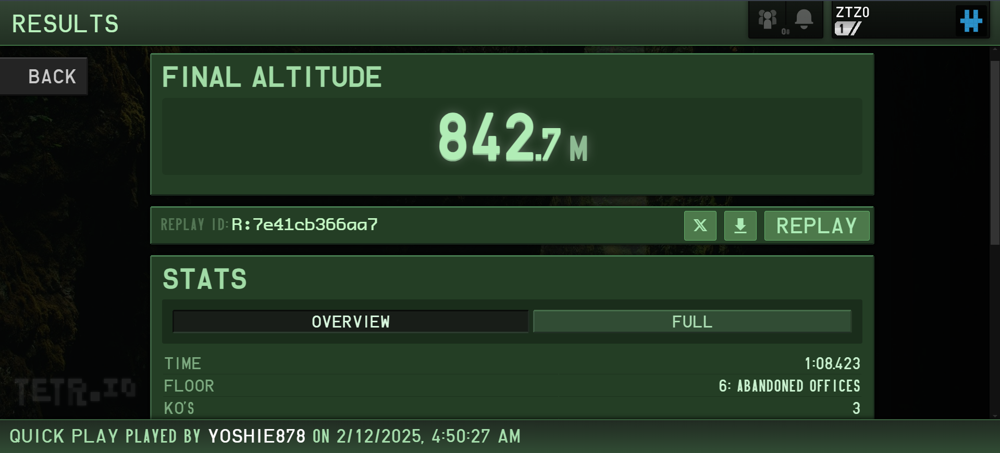
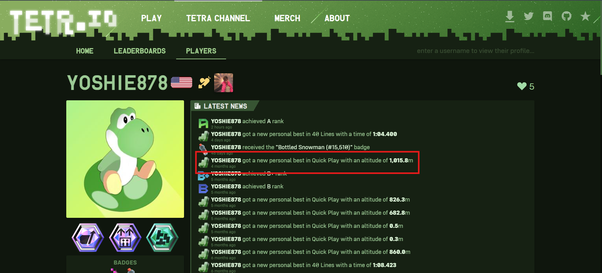
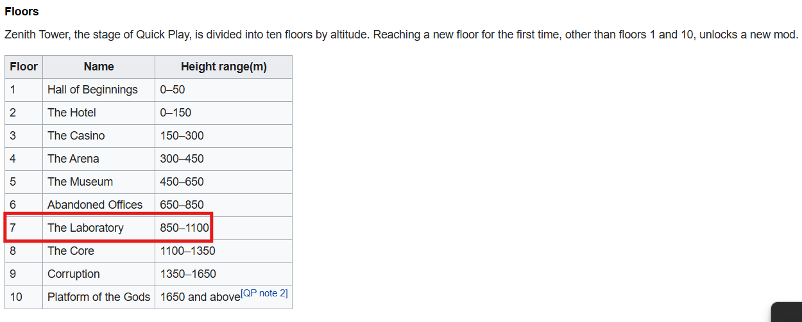

> YOOOO check out this new personal best in sprint that my bestie yoshie just got! He truly is the elitest elite stacker of all time! (p.s. not really. he needs *waaaay* more T-Spins.)
>
> Ok honestly though, that mode is boooooring. Where's all the garbage at? No challenge at all.
>
> Tell me, what is the highest floor and altitude in the Zenith Tower that yoshie has climbed up to?
>
> **Flag Format:** `bronco{<Floor Name> <Altitude>}`, where:
>
> - `Floor Name` is the name (NOT number) of the floor. Include space(s).
>
> - `Altitude` is a number to one decimal place, commas optional, with `m` at the end for meters.
>
> - There is a space between the entries.

By yoshie878

---

So they give a file named `imthegoatatstacking_7e41cb366aa7.ttr` which is a replay file for the game [tetr.io](https://tetr.io/). I downloaded the file and opened it in the game. The game is a tetris game and the replay file is a recording of a game played by the user. The user in this case is `yoshie878`.

The user mentions that he is the "elitest elite stacker of all time" and that he needs "waaaay more T-Spins". This is a hint that the user is good at the game and that he is not satisfied with his current performance.

The user also mentions that the mode is boring and that there is no challenge at all. This is a hint that the user is playing in a mode that is not challenging enough for him.

The user asks for the highest floor and altitude in the **Zenith Tower** that he has climbed up to. This is a hint that the user has played in the **Zenith Tower** mode and has reached a high floor and altitude.

By viewing the player's profile, we can see that the user has played in the **Zenith Tower** mode and has reached a high floor and altitude. The highest altitude that the user has reached is **1,015.8m**.

Because the replay file is expired, we cannot view the replay of the game. However, we can search the floor name in Google and find the altitude of the floor. Which is **The Laboratory** floor.
