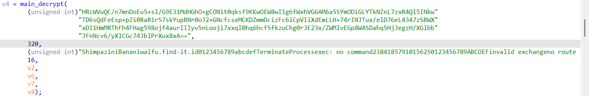
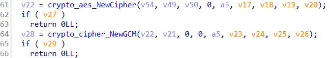
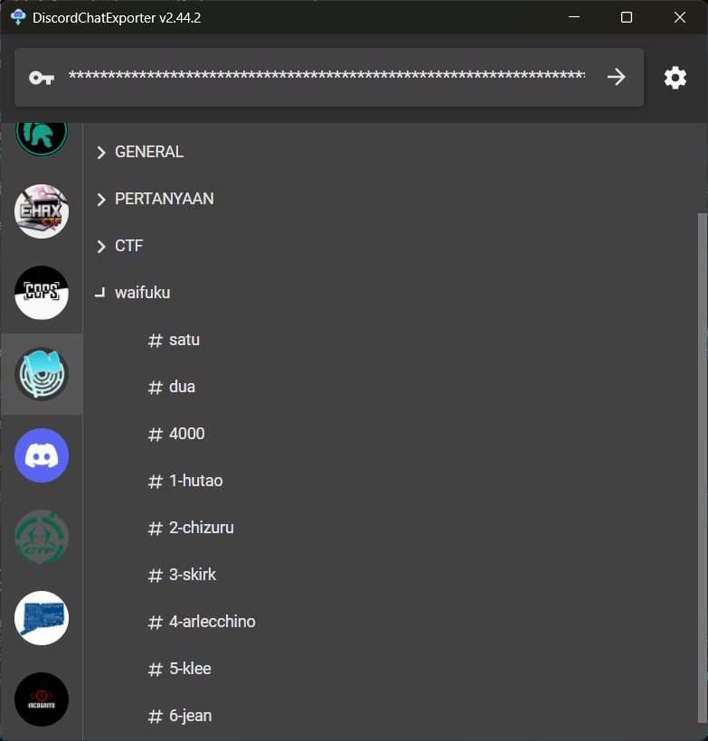

> pecinta waifu ternyata kurang puas sama stealer dia sebelumnya, sekarang dia bikin info stealer baru
>
> jangan lupa FindITCTF{}

by `hilmo`

---

We were given a file `new-waifu.exe`, and it turns out that this is an information stealer. When executed, the file sends some information to `waifu.find-it.id`. But since we can reverse engineer it, let's just go ahead and reverse engineer it (I'm not an expert in forensics anyway).



This image shows the parameters used to call the `main_decrypt` function.



In the `main_decrypt` function, we can see that **AES GCM** is used for decrypting the data. We also see that there is a `key` sourced from `key_source` and `ciphertext` from `base64_ciphertext`.

```py
import base64
from Crypto.Cipher import AES

base64_ciphertext = (
    "6kGrsTkEwA0bU526wlqbjD98CkEP7jqAw3oEm2oTHS9wnXWer25jeDmNnCq088+mKXXN36QcQkFGL7xp8hPqvV66JZkRinvWFW/pZ"
    "Tybuo5NR9MsKLl5LKQ+APRU5e10h4lD2y607Z90x0yzHkuCeuG4vzBYiTwzNv0YvXAEkn8VUEklZ3ngsg9T6UZm4HvJdJUiPkzg8p"
    "VBJNaCmgSdkYCdzuhBPDhnbGo+xqQAvsl97hjlNFNKTqazjdLJgJLwl+juzLQwzBUiW9Fi55aGmIbrO2SDFTZSSlJNhNXqcTlA"
)
key_source = (
    "ShimpaziniBananiwaifu.find-it.id0123456789abcdefTerminateProcessexec: no command23841857910156250123456789ABCDEFinvalid exchangeno route to hostinvalid argumentmessage too longobject is remoteremote I/O errorSetFilePointerExOpenProcessTokenRegQueryInfoKeyWRegQueryValueExWDnsNameCompare_WCreateDirectoryWFlushFileBuffersGetComputerNameWGetFullPathNameWGetLongPathNameWRemoveDirectoryWNetApiBufferFreeDuplicateTokenExGetCurrentThreadGetModuleHandleWRtlVirtualUnwindinteger overflowgcshrinkstackofftracefpunwindoffGC scavenge waitGC worker (idle)page trace flush/gc/gogc:percent, not a functiongc: unswept span KiB work (bg),  mheap.sweepgen=runtime: nelems=workbuf is emptymSpanList.removemSpanList.insertbad special kindbad summary dataruntime: addr = runtime: base = runtime: head = timeBeginPeriod"
)

key = key_source[:16].encode("utf-8")
data = base64.b64decode(base64_ciphertext)

nonce_size = 12
nonce = data[:nonce_size]
ciphertext_and_tag = data[nonce_size:]

try:
    cipher = AES.new(key, AES.MODE_GCM, nonce=nonce)
    plaintext = cipher.decrypt_and_verify(ciphertext_and_tag[:-16], ciphertext_and_tag[-16:])
    print("Decrypted plaintext:", plaintext.decode("utf-8"))
except Exception as e:
    print("Decryption failed:", str(e))
```

Decrypting the `base64_ciphertext` using the `key_source` we get the following plaintext:

```
All waifu names except the ones that are minors in Discord CTF FindIt 2025, in reverse order, spaces replaced with underscores. Who even thought of using Golang with native Windows APIs, haha, idea came at midnight :D
```

Okay, now we just need to use `DiscordChatExporter` to get all the waifu names from the Discord channel.



From the exported chat, we get the following waifu names:

```
1. hutao
2. chizuru
3. skirk
4. arlecchino
5. klee
6. jean
```

Since `klee` is considered a minor, we exclude it and the remaining names in reverse order are `jean_arlecchino_skirk_chizuru_hutao`.
