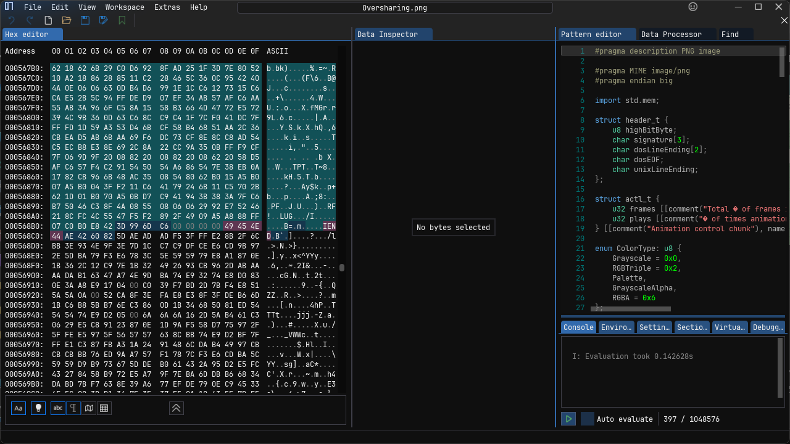

> Yo man wassup,
>
> I am so excited, finally passed my probation. Just got assigned to this new high impact project. The IT guy just gave me my account for the project, check out the chat! Can't wait to login and show my worth :D

by `BerlianGabriel`

---

We are given a file called `Oversharing.png`, which contains a chat image between the sender and the receiver. When I examined the bytes of the image, I found something interesting: there are two `IEND` markers within the byte sequence of the image.

After further investigation, I discovered that this PNG image had been modified. I tried removing the second `IEND` and saved it as a new PNG file, but nothing happened.

Because the image appeared to be cropped, I decided to search Google using the keyword `Image cropped writeup`. I found a [writeup](https://ctftime.org/writeup/37176) that explained how to restore a cropped PNG image, which was caused by a bug known as `aCropalypse`. This bug existed in a screenshot application on Android. The bug allowed users to edit images and save them, but the saved image did not fully erase the original parts of the image. In other words, the edited image still contained portions of the original image that were supposed to be removed.

So, we can use the website [acropalypse](https://acropalypse.app/) to restore the cropped image. Select `Pixel 5` and upload the image to the website. Once processed, we will get the full image that had been cropped.

