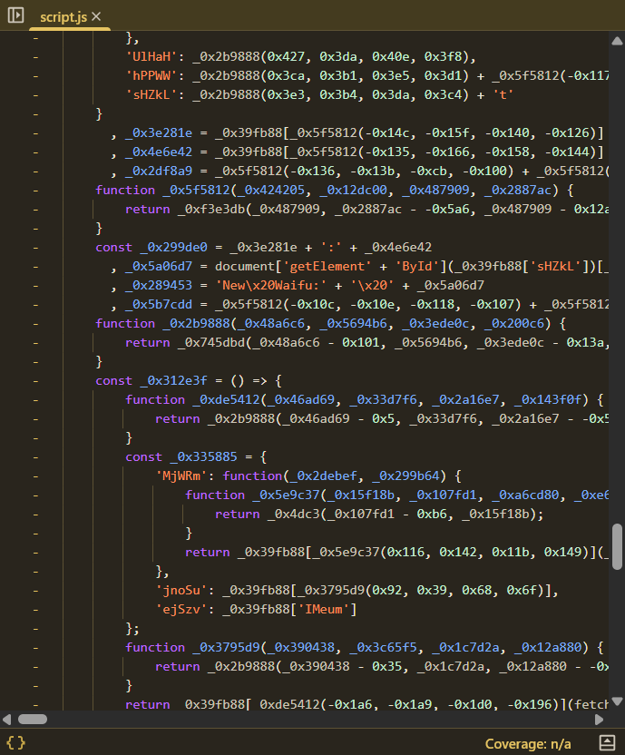
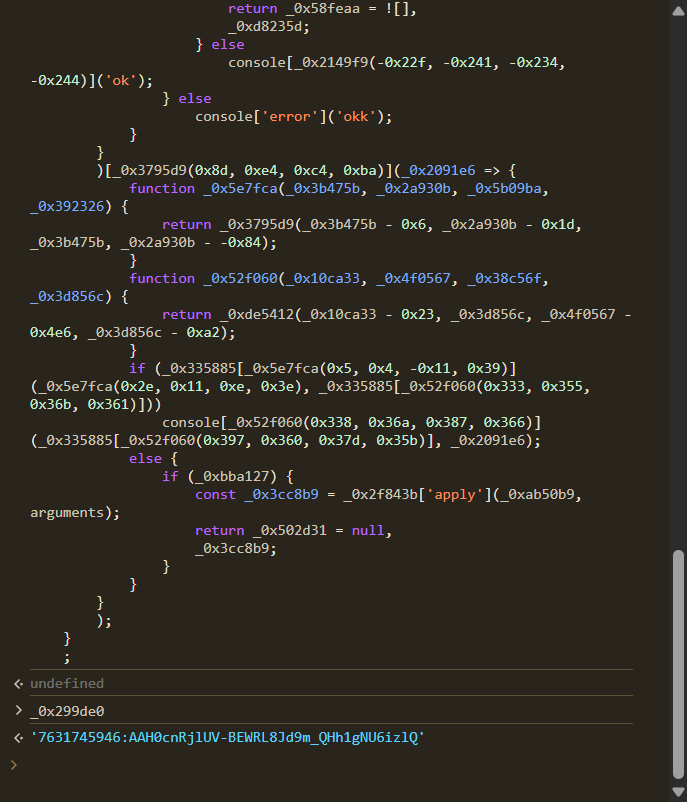
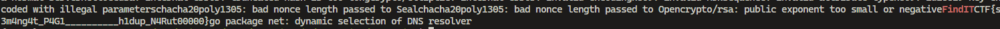

> pecinta waifu ternyata seorang info stealer? hahh 🥶🥶 bongkar semua kedoknya dia
>
> format flag: FindITCTF<flag>

by `hilmo`

---

Forensics but we got a website???


There is a form to submit our waifu. Let's try submitting one.


After submission, a message pops up.


So, this likely involves some JavaScript code that runs on the page and possibly makes a request to the backend server. However, the message looks like regular JavaScript execution, so we take a closer look at the source code.



Since the JavaScript code is obfuscated, I decided to inspect the function and variable contents directly from the browser console.



By copying the content of the `simpasini()` function and inspecting the `_0x299de0` variable, I discovered what looks like a Telegram Bot token:
`7631745946:AAH0cnRjlUV-BEWRL8Jd9m_QHh1gNU6izlQ`.

This appears to be a valid bot token. Let’s try checking the bot’s update history using Telegram’s API:

```sh
curl -X GET "https://api.telegram.org/bot7631745946:AAH0cnRjlUV-BEWRL8Jd9m_QHh1gNU6izlQ/getUpdates"
```

At the time of writing this, unfortunately, the updates are already gone—perhaps this method was unintended. However, earlier during the event, I was able to view some Telegram updates. The messages contained files uploaded to the bot and a few strings in Unicode format, which can be decoded into readable text.

After trying to download some of the uploaded files, I found one file that contained the flag.

```sh
curl https://api.telegram.org/file/bot7631745946:AAH0cnRjlUV-BEWRL8Jd9m_QHh1gNU6izlQ/documents/file_1.exe -o file_1.exe
```

Running the `strings` command on `file_1.exe` gives us some interesting strings. One of them is `FindITCTF`, which is exactly what we are looking for.

```sh
strings file_1.exe | grep "FindIT"
```


