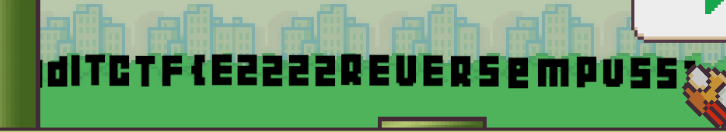

> Beat my score and I will give you the flag. Don't cheat!
>
> Hint: My score = 9999999

by `hilmo`

---

We are given a game called `ezBird`. This game is similar to `Flappy Bird` but much easier. The objective is to achieve a score of `9999999` in order to obtain the flag. The game is written using `Unity` and uses `il2cpp` to compile the C# code into `C++`.

We can use `il2cppdumper` to decompile the `ezBird` file. After decompiling, we get several files, one of which is `Assembly-CSharp.dll`. We can open this file using `ilSpy`. Once opened, we can see several classes inside this file.

Since I was too lazy to go through all the steps, the gist of it is that when we open `Assembly-CSharp.dll`, there is a class that handles the 2D collision detection. Every time we collide in the game, our score increases by 1. However, there is also a variable called the anti-cheat score, which decreases by 0.3 every time we hit a collision. Additionally, there are two other variables that are set to one when our score reaches `9999999`, or when the anti-cheat score reaches `-3000000`.

Because I didn’t want to go through all the patching work, I simply used `Cheat Engine` to find the address of these functions. After locating it, I directly nopped the instructions that handle the anti-cheat score check. After bypassing this check, I was able to pass through a pipe and the flag appeared on the screen.

