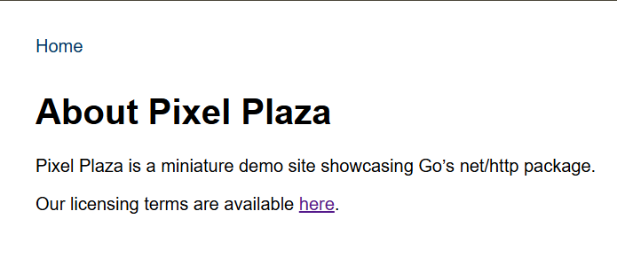

> I'm a consultant, but my client is using a new technology I'm not familiar with. Can I outsource this whitebox pentest project to you?

by `BerlianGabriel`

---

We are given a web application built using Go, and we also have access to its source code. Upon examining the source code, we can see that the application uses `embed` to store static files within the binary. The code reveals that several files are stored in the `public` folder, including an `index.html` file, which is displayed when we access the root path `/`.

There are also some interesting handlers, such as `/` and `/static/`. When we access `/static/`, we receive static files from the `public` folder, while accessing `/` serves the `index.html` file from the same folder.

```go
fileServer := http.FileServer(http.FS(webFS))
mux.Handle("/static/", http.StripPrefix("/static/", fileServer))
mux.HandleFunc("/", staticHandler)
```

What is particularly interesting is that the handler for the root path `/` is `staticHandler`, which serves the `index.html` file if we access the root path `/`, and serves static files from the directory inside the binary if we access other paths.

```go
func staticHandler(w http.ResponseWriter, r *http.Request) {
	if r.URL.Path == "/" {
		data, _ := webFS.ReadFile("public/index.html")
		w.Write(data)
		return
	}
	p := "." + r.URL.Path
	if _, err := os.Stat(p); err != nil {
		io.WriteString(w, "Resource not found.")
		return
	}
	f, err := os.Open(p)
	if err != nil {
		http.NotFound(w, r)
		return
	}
	defer f.Close()
	fi, err := f.Stat()
	if err != nil {
		http.NotFound(w, r)
		return
	}
	http.ServeContent(w, r, filepath.Base(p), fi.ModTime(), f)
}
```

However, we can also access files outside the binary folder using path traversal. For example, we can try to access the `banner.png` file located in the `docs` folder by using the path `/..%2fdocs/banner.png`. But when I attempted to find `flag.txt` in several typical paths, I couldn’t locate it.



After revisiting the website, I noticed there was a link in the "About" section for viewing the license. However, this link leads to `/docs/text` and shows a message indicating that the resource was not found.

We can try path traversal again to access `/..%2fdocs/text` by navigating to `http://ctf.find-it.id:6001/..%2f/docs/text`, and this reveals the contents of the `text` file, which contains the flag we are looking for.
