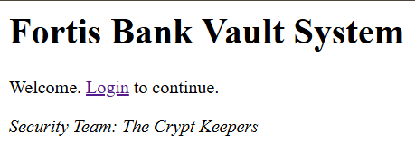
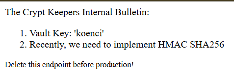
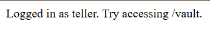
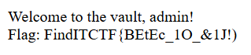

> gampang sekali, tinggal cari kunci dari brankasnya
>
> cuma internal yang boleh tau banyak hal

by `hilmios`

---

When we visit the homepage, we will see a screen like this:



Here, we can log in, but we will immediately be logged in as the user `teller` from `Fortis Bank`.

Since the description includes the keyword `internal`, we try to access `/internal`, and we get a screen like this:



When we check the cookies, we find two cookies: `auth` and `sig`. The `auth` cookie contains `user:teller|bank:Fortis Bank`, and the `sig` cookie contains the **HMAC SHA256** of the `auth` value.



On the `/login` page, we are instructed to access `/vault`, but we cannot access it because we are not `admin` and the bank we are using is `Fortis Bank`.

We try to modify the `auth` cookie to `user:admin|bank:Fortis Bank` and then update the `sig` cookie to be the **HMAC SHA256** of the new `auth` value.

Here’s how we can create **HMAC SHA256** using [CyberChef](https://gchq.github.io/CyberChef/#recipe=HMAC(%7B'option':'Latin1','string':'koenci'%7D,'SHA256')&input=dXNlcjphZG1pbnxiYW5rOkZvcnRpcyBCYW5r).

```
auth: "user:admin|bank:Fortis Bank"
sig: 7f5976dcdc018b18b360aad2d4c5b3efe099db2bbba363bad5c1932b137f41ba
```

After obtaining the new `auth` and `sig` cookies, we try to access `/vault` and will see a screen like this:


