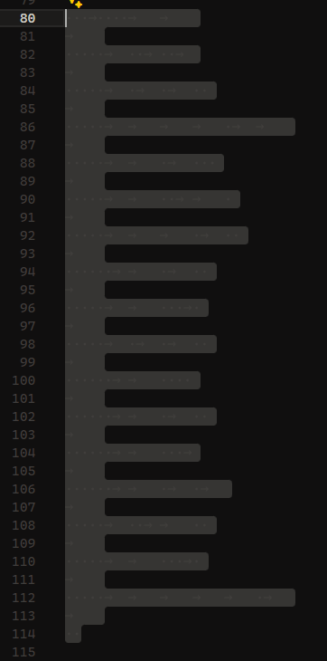

> Find the flag.
>
> Flag Format: CIT{example_flag}

by `ronnie`

---

Given `calculator.lua` file, we can see that it is a simple calculator program that takes input from the user and evaluates it. But when we scroll down, we can see that there is a empty line that is nothing interesting.

We can see when we highlight the empty line, it shows us a space and tab character. After some search, I found out that this is some kind of a language? Use this website [Whitelips IDE](https://vii5ard.github.io/whitespace/) to decode the whitespace code.

