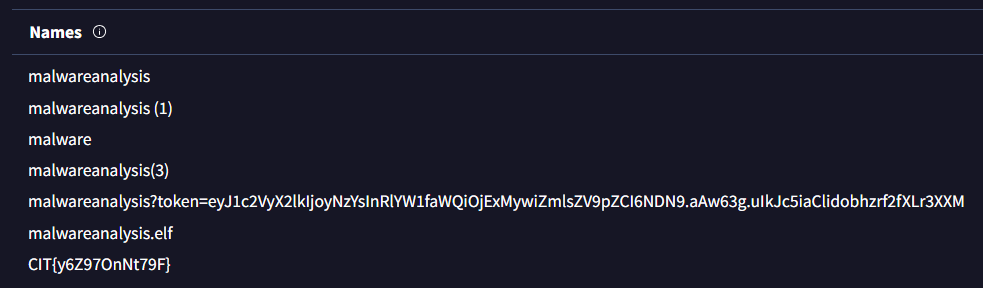

> I got this file here and I think it might be malware but I'm not sure hopefully u can figure it out!!!

by `ronnie`

---

Given a file `malwareanalysis`, so i decided to reverse engineer it. After some fucking hours of debugging and analyzing the file, i found out that it is just a non-sense program that just `cURLs` a random http request to random ip address.

However, after a while, I decided to upload the file to `VirusTotal` and review the analysis results. In the details section, I discovered that the original submitted filename actually contained the flag.

