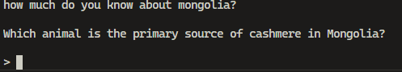

> Send us a clip of you singing your heart out to The Hu for the flag!
>
> Just kidding, open that terminal and get to work.
>
> `nc 23.179.17.40 5393`

by `boom`

---

Running the netcat command gives us a prompt, that we need to answer all the questions correctly to get the flag.



Just like the prompt says, we need to answer all the questions correctly. The questions are about the Mongolian. We can find the answers to the questions by searching on Google, Wikipedia, or any other search engine or ChatGPT.

We can automate the process of answering the questions by using a simple Python script. The script will connect to the server and answer all the questions correctly.

```py
from pwn import *

r = remote('23.179.17.40', 5393)

questions = {
    'In which year did the Mongol Empire officially split into four khanates?': '1260',
    'What important Mongol battle occurred in 1241 that delayed the Mongol invasion of Europe?': 'Battle of Legnica',
    'Which animal is the primary source of cashmere in Mongolia?': 'Cashmere goats',
    'Which species of wild goat in Mongolia is famous for its badass horns?': 'Siberian ibex',
    'Which famous traveler from Venice visited the Mongol Empire during the reign of Kublai Khan?': 'Marco Polo',
    'Which Mongol leader was known for his conquest of the Song Dynasty in China?': 'Kublai Khan',
    "What is Mongolia's primary export commodity?": 'Coal',
    'What is the official currency of Mongolia?': 'Tugrik',
    'What is the second-largest export product of Mongolia after coal?': 'Copper',
    'Which famous Mongol general and grandson of Genghis Khan is known for leading the conquest of the Ilkhanate in Persia?': 'Hulegu Khan',
    'Which species of wild goat in Mongolia is famous for its badass horns?': 'Markhor',
    'Which famous Mongol khanate ruled over much of Russia, Ukraine, and parts of Central Asia during the 13th and 14th centuries?': 'Golden Horde',
    'In what year did Mongolia join the World Trade Organization (WTO)?': '1997',
    "Which Mongol leader attempted to invade Japan twice, in 1274 and 1281, but was thwarted by powerful typhoons, known as the 'kamikaze' winds?": 'Kublai Khan',
    'What important Mongol battle occurred in 1241 that delayed the Mongol invasion of Europe?': 'The Battle of Mohi',
    'What is the name of the book that Marco Polo wrote about his travels to the Mongol Empire?': 'The Travels of Marco Polo',
    'Which population migration is responsible for bringing the majority of Y-chromosomal lineages in South Kazakhstan?': "Niru'un Mongols",
    'What animal is used extensively by Mongolian herders for milk, wool, and meat?': 'Yak',
    'Who was the founder of the Mongol Empire?': 'Genghis Khan',
    'What is the name of the wild camel species found in Mongolia?': 'bactrian camels',
    'Which group do the majority of Kazakhs from South Kazakhstan belong to?': 'Senior Zhuz',
    'Which famous Mongol general and grandson of Genghis Khan is known for leading the conquest of the Ilkhanate in Persia?': 'Hulegu Khan'
}

r.recvuntil(b'how much do you know about mongolia?')
while True:
    r.recvline()
    r.recvline()
    question = r.recvline().decode().strip()
    print(f'Question: {question}')

    answer = None
    for q in questions:
        if q in question:
            answer = questions[q]
            break

    if answer:
        print(f'Answer: {answer}')
        r.sendline(answer.encode())
        continue

    print('Unknown Question')
    r.interactive()
    break
```
