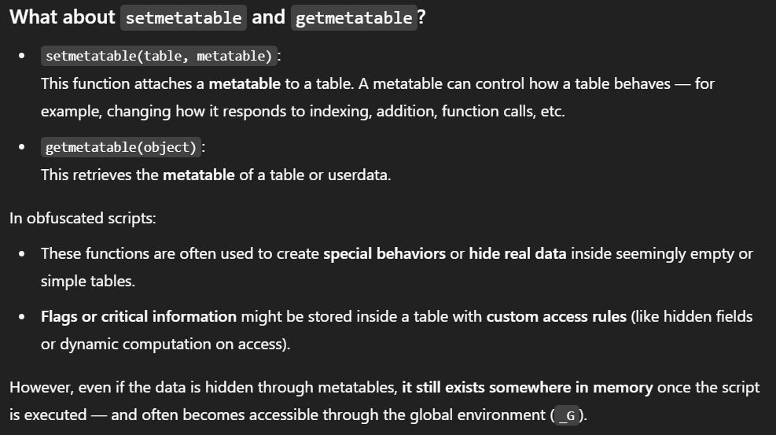

> Find the flag.
>
> Flag Format: CIT{example_flag}
>
> If you cannot solve this challenge using PUC Lua, try using LuaJIT instead.

by `ronnie`

---

Given a file `stillmeta.lua`, we can see that the file is a Lua script. The script contains a lot of obfuscated code, but it also contains some hints about the flag.

```
function(N,X)local f=g(X)local E=function(E,m,d,J)return G(N,{E;m,d,J},X,f)end return E end,{}return(W(630955+12938805,{}))(f(P))end)(getfenv and getfenv()or _ENV,unpack or table[X((-394860-(-807224))+-430539)],newproxy,setmetatable,getmetatable,select,{...})end)(...)
```

The script is obfuscated, but we can see that it uses some functions like `getfenv`, `unpack`, `newproxy`, `setmetatable`, and `getmetatable`. These functions are used to manipulate the Lua environment and create new objects. 

Based on ChatGPT's explanation, the script is trying to create a new environment and execute some code in that environment.



Instead of manually reversing the obfuscated code, we can safely load and inspect the script's global variables to find the flag.

```lua
local ok, result = pcall(dofile, "stillmeta.lua")
if not ok then
  print("Error loading stillmeta.lua: " .. result)
  return
end

for k, v in pairs(_G) do
  if type(v) == "string" and v:find("CIT{") then
    print(k .. ": " .. v)
  end
end
```
