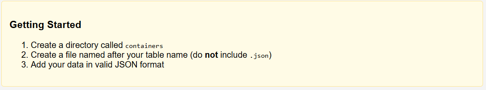
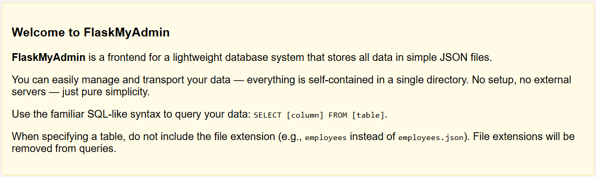

> "This is the story of how I defined your schema."
>
> The flag is in secrets.txt
>
> Note: this web challenge instance will reset every 30 minutes. If a challenge is not responsive, you might need to wait until the next half hour.
>
> http://23.179.17.40:58004/

---

Just a simple web challenge where we can see a JSON file with some data with `SQL` like queries (`SELECT` only). When we try to run the query, we can see

```
http://23.179.17.40:58004/select?record=*&container=employees
```

We see this project is called **FlaskMyAdmin**, which stores all data in **JSON files** inside a `containers/` directory.



There is a **Local File Inclusion (LFI)** vulnerability in the `container` parameter:

- The server reads files based on the name given in `container`.
- It automatically removes the `.json` extension.
- However, if we try to read something like `secrets.txt`, it strips `.txt` and the request fails.



Since `secrets.txt` is **not** inside the `containers/` directory, we must move up one directory.  
However, traditional `../` is blocked.

**Bypass for `../` filter:**
- Use `....//` instead of `../`
- Double dots `..` then two slashes `//` confuse simple path filters but still work for directory traversal.

Also, because of the extension stripping, **we must still use `.txt.txt** at the end.

Putting everything together:

```plaintext
http://23.179.17.40:58004/select?record=*&container=....//secrets.txt.txt
```

- `....//` moves up to the parent directory.
- `secrets.txt.txt` bypasses the file extension check.

This successfully retrieves the `secrets.txt` file and reveals the flag.
