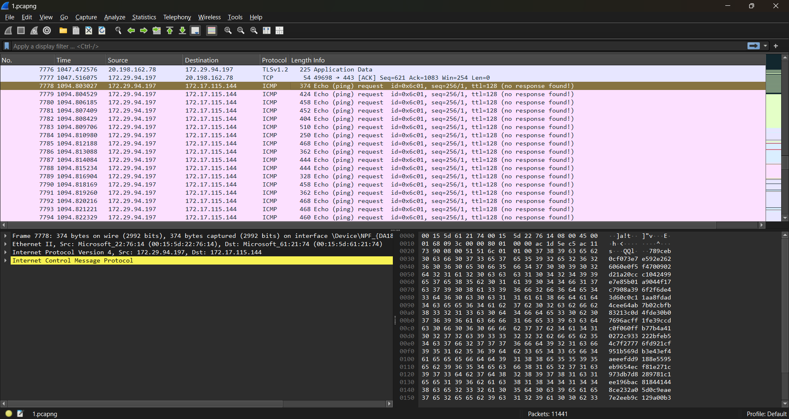
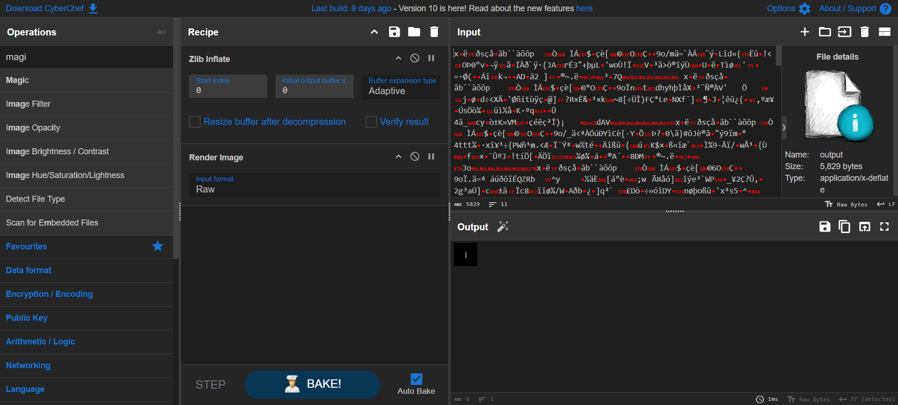
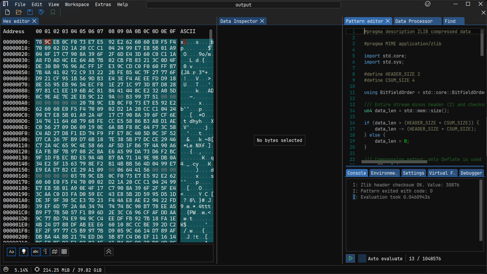
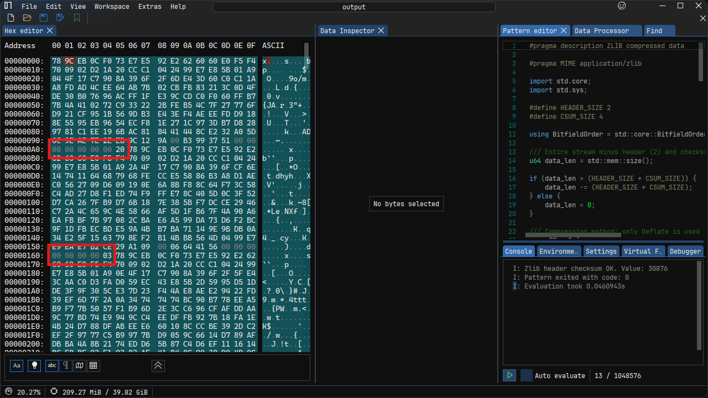

> have you ever heard that there is a shark exist in the clouds?

by `keii`

---

We are given a `1.pcapng` file and tasked with extracting a flag from it. After scrolling through the packets for several minutes, I found something interesting.



There is an `ICMP` packet with a long payload. By combining all the `ICMP` packets, I obtained a long string.



Using CyberChef, I discovered that the data is a `PNG` file compressed with `zlib`. However, I was puzzled because the data was quite long, but the image size was small.



Upon further inspection in `ImHex`, I noticed multiple `zlib` headers. I extracted all the images based on their order, but the resulting words were scrambled. Even after reversing the order, the result was still meaningless.

Looking at the hex data again, I found something suspicious: there were 8 bytes of data with a range between 0 and 30.



Here is the exploit script used to extract and process the data:

```python
import scapy.all as scapy
import zlib

# Read the pcapng file
scapy_cap = scapy.rdpcap('1.pcapng')

# Extract ICMP payloads and write to a file
with open('output', 'wb') as f:
    for packet in scapy_cap:
        if packet.haslayer(scapy.ICMP):
            f.write(bytes.fromhex((bytes(packet.payload)[28:]).decode('utf-8')))

# Read the extracted data
with open('output', 'rb') as f:
    data = f.read()

# Split the data by zlib headers and decompress each part
parts = data.split(b'\x78\x9c')

for part in parts[1:]:
    try:
        print(f'Last 1-byte: {ord(part[-1:])}')
        decompressed = zlib.decompress(b'\x78\x9c' + part)
        with open(f'z_{ord(part[-1:])}.png', 'wb') as out:
            out.write(decompressed)
    except Exception:
        continue
```
