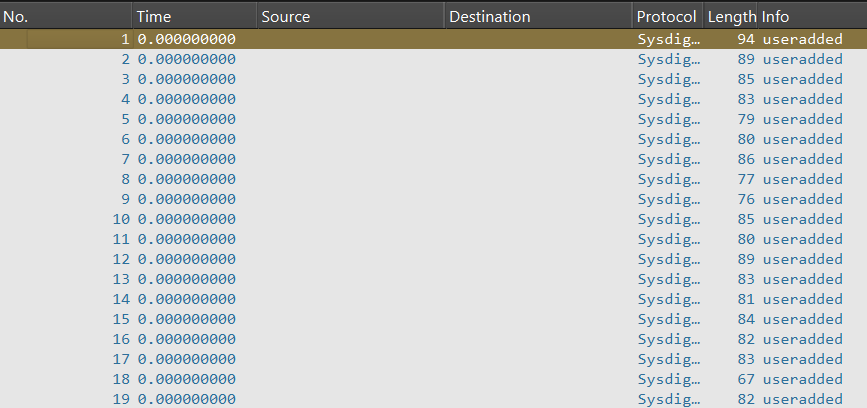
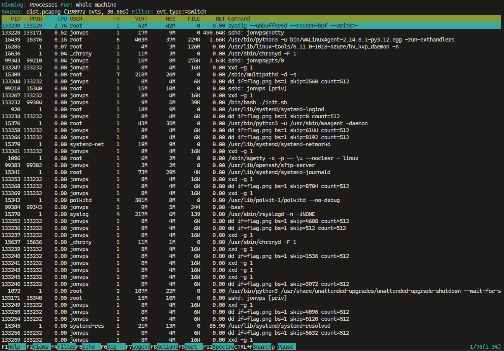

> have you ever heard that there is a shark exist in the clouds?

by `keii`

---

We are given a `dist.pcapng` file and need to extract a flag from it. The challenge hints at the use of `sysdig`, which is a powerful tool for analyzing system calls and events.



Since the challenge involves `sysdig`, we can analyze the provided `dist.pcapng` file using `sysdig`.

To start, we open the file with the following command:

```bash
csysdig -r dist.pcapng
```



From the analysis, we find a reference to `flag.png`. The file appears to be split into chunks of 2048 bytes, which can be extracted using the following command:

```bash
sudo sysdig -x -r /mnt/c/Users/zenta/Downloads/dist.pcapng \
  "fd.name contains \"flag.png\" and evt.type=read" \
  | grep "0x" | awk '{print $2}' > bytes.txt
```

The extracted hex data is stored in `bytes.txt`. Since the hex data is read one byte at a time (as indicated by `xxd -g 1`), we need to concatenate the lines and decode the hex data into a binary file. This can be done with the following command:

```bash
cat bytes.txt | tr -d '\n' | xxd -r -p > flag.png
```

After running the above commands, we successfully extract `flag.png`. Opening the file reveals the flag:


