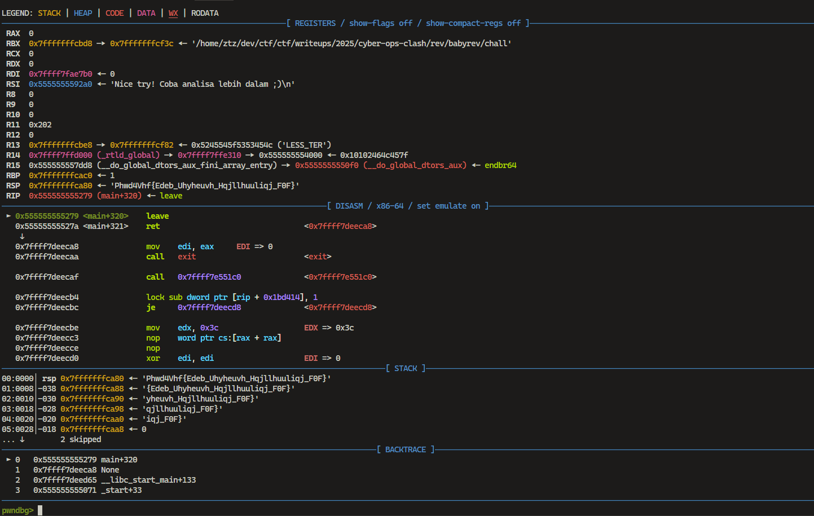

> Hanya basic Reverse Engineering aja

by `zfernm`

---

We were given a file named `chall`, but it seemed like there was nothing in it, and we were just told to "try harder analysis." So, we decided to use `gdb`.

Using `gdb`, we set a breakpoint at a specific offset in the `main` function with the following commands:

```bash
b *main+320
r
```

- `b *main+320`: Sets a breakpoint at offset `320` from the start of the `main` function.
- `r`: Runs the program until it hits the breakpoint.

Once the program stops at the breakpoint, we analyze the program's state, such as registers and memory.



The dynamic analysis shows that the output is encoded using a `ROT cipher`. To decrypt it, we use [CyberChef](https://gchq.github.io/CyberChef/). By brute-forcing the `ROT cipher`, we find that the correct rotation is `23`.
