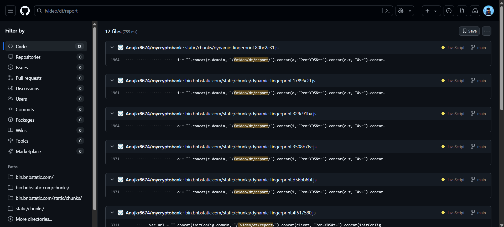
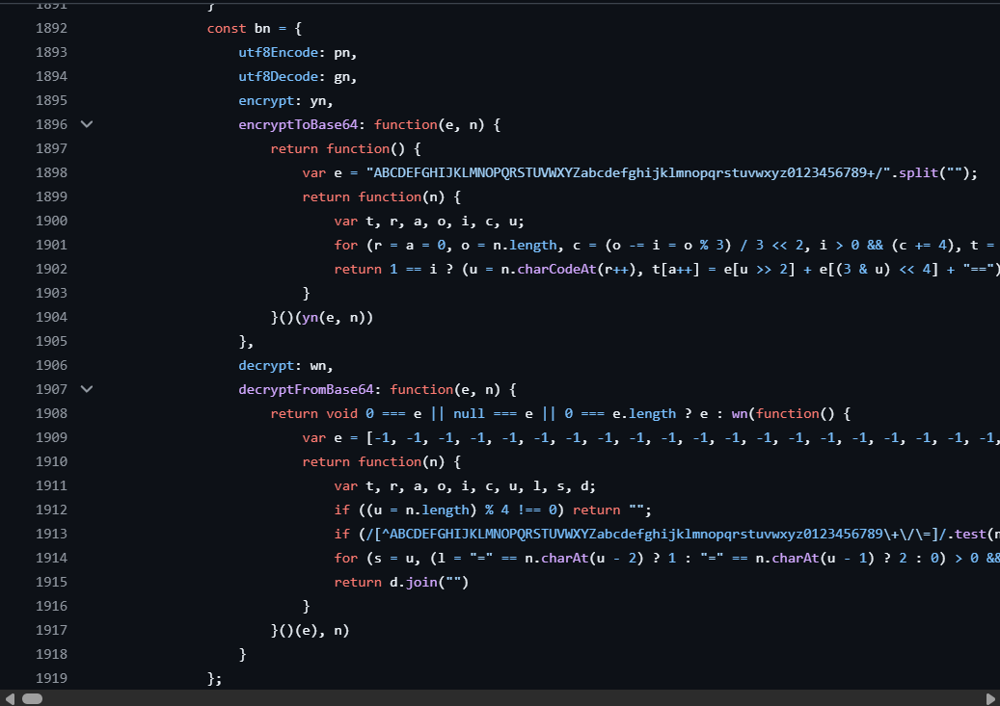
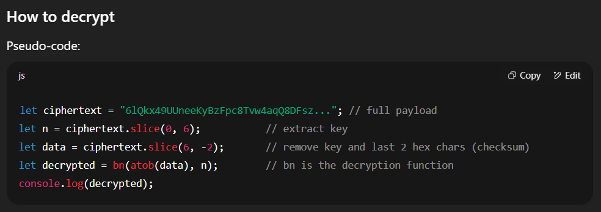
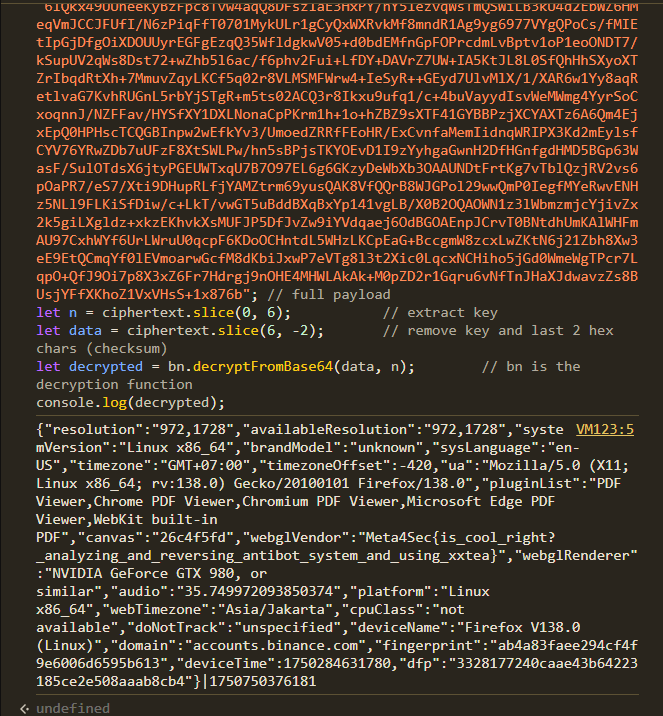

> Not into novel reverse challenges? Want something more real-world? Here you go . just keep it ethical
>
> your goals here to reverse how binance fingerprints work. the flag is in the encrypted payload

by `replicant`

---

We were tasked with reversing how Binance's fingerprinting system works. The flag was hidden in the encrypted payload.

The challenge started with an HTTP POST request to the Binance endpoint:

```http
POST /fvideo/dt/report/web?en=YDS&t=binance&v=2025.01.10 HTTP/2
Host: accounts.binance.com
Sec-Ch-Ua: 
Content-Type: application/json
Sec-Ch-Ua-Mobile: ?0
User-Agent: Mozilla/5.0 (Windows NT 10.0; Win64; x64) AppleWebKit/537.36 (KHTML, like Gecko) Chrome/115.0.5790.171 Safari/537.36
Sec-Ch-Ua-Platform: ""
Accept: */*
Origin: https://accounts.binance.com
Sec-Fetch-Site: same-origin
Sec-Fetch-Mode: cors
Sec-Fetch-Dest: empty
Accept-Encoding: gzip, deflate
Accept-Language: en-US,en;q=0.9

6lQkx49UUneeKyBzFpc8Tvw4aqQ8DFsz1aE3HxPY/nY51ezvqWsTmQSWiLB3kU4d2EbWZ6HMeqVmJCCJFUfI/N6zPiqFfT0701MykULr1gCyQxWXRvkMf8mndR1Ag9yg6977VYgQPoCs/fMIEtIpGjDfgOiXDOUUyrEGFgEzqQ35WfldgkwV05+d0bdEMfnGpFOPrcdmLvBptv1oP1eoONDT7/kSupUV2qWs8Dst72+wZhb5l6ac/f6phv2Fui+LfDY+DAVrZ7UW+IA5KtJL8L0SfQhHhSXyoXTZrIbqdRtXh+7MmuvZqyLKCf5q02r8VLMSMFWrw4+IeSyR++GEyd7UlvMlX/1/XAR6w1Yy8aqRetlvaG7KvhRUGnL5rbYjSTgR+m5ts02ACQ3r8Ikxu9ufq1/c+4buVayydIsvWeMWmg4YyrSoCxoqnnJ/NZFFav/HYSfXY1DXLNonaCpPKrm1h+1o+hZBZ9sXTF41GYBBPzjXCYAXTz6A6Qm4EjxEpQ0HPHscTCQGBInpw2wEfkYv3/UmoedZRRfFEoHR/ExCvnfaMemIidnqWRIPX3Kd2mEylsfCYV76YRwZDb7uUFzF8XtSWLPw/hn5sBPjsTKYOEvD1I9zYyhgaGwnH2DfHGnfgdHMD5BGp63WasF/SulOTdsX6jtyPGEUWTxqU7B7O97EL6g6GKzyDeWbXb3OAAUNDtFrtKg7vTblQzjRV2vs6pOaPR7/eS7/Xti9DHupRLfjYAMZtrm69yusQAK8VfQQrB8WJGPol29wwQmP0IegfMYeRwvENHz5NLl9FLKiSfDiw/c+LkT/vwGT5uBddBXqBxYp141vgLB/X0B2OQAOWN1z3lWbmzmjcYjivZx2k5giLXgldz+xkzEKhvkXsMUFJP5DfJvZw9iYVdqaej6OdBGOAEnpJCrvT0BNtdhUmKAlWHFmAU97CxhWYf6UrLWruU0qcpF6KDoOCHntdL5WHzLKCpEaG+BccgmW8zcxLwZKtN6j21Zbh8Xw3eE9EtQCmqYf0lEVmoarwGcfM8dKbiJxwP7eVTg8l3t2Xic0LqcxNCHiho5jGd0WmeWgTPcr7LqpO+QfJ9Oi7p8X3xZ6Fr7Hdrgj9nOHE4MHWLAkAk+M0pZD2r1Gqru6vNfTnJHaXJdwavzZs8BUsjYFfXKhoZ1VxVHsS+1x876b
```

## Finding the Decryption Method

While searching for the endpoint path on GitHub, I stumbled upon some related code.





The code revealed a function named `decryptFromBase64`, which seemed to be the key to decrypting the payload. Using this function, I attempted to decrypt the payload.

## Decrypting the Payload

I used ChatGPT to help understand the decryption process and fix any undefined functions. 



Afterward, I executed the decryption code directly in the browser console on Binance's website.



The decrypted payload revealed the following JSON data:

```json
{"resolution":"972,1728","availableResolution":"972,1728","systemVersion":"Linux x86_64","brandModel":"unknown","sysLanguage":"en-US","timezone":"GMT+07:00","timezoneOffset":-420,"ua":"Mozilla/5.0 (X11; Linux x86_64; rv:138.0) Gecko/20100101 Firefox/138.0","pluginList":"PDF Viewer,Chrome PDF Viewer,Chromium PDF Viewer,Microsoft Edge PDF Viewer,WebKit built-in PDF","canvas":"26c4f5fd","webglVendor":"Meta4Sec{is_cool_right?_analyzing_and_reversing_antibot_system_and_using_xxtea}","webglRenderer":"NVIDIA GeForce GTX 980, or similar","audio":"35.749972093850374","platform":"Linux x86_64","webTimezone":"Asia/Jakarta","cpuClass":"not available","doNotTrack":"unspecified","deviceName":"Firefox V138.0 (Linux)","domain":"accounts.binance.com","fingerprint":"ab4a83faee294cf4f9e6006d6595b613","deviceTime":1750284631780,"dfp":"3328177240caae43b64223185ce2e508aaab8cb4"}|1750750376181
```
