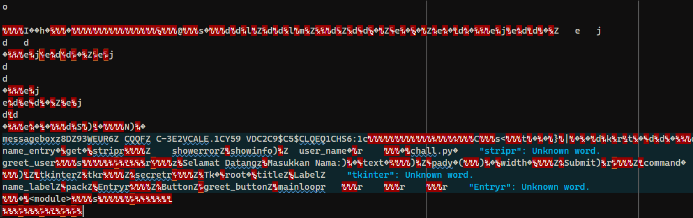
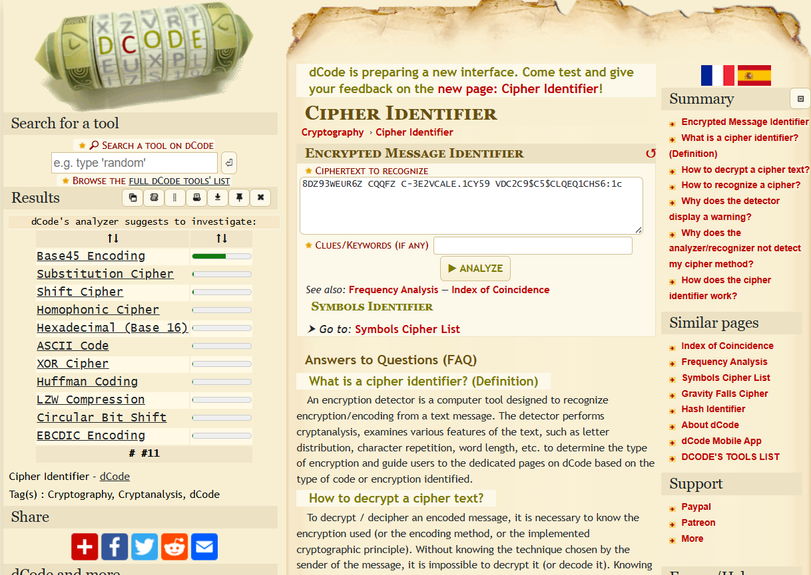
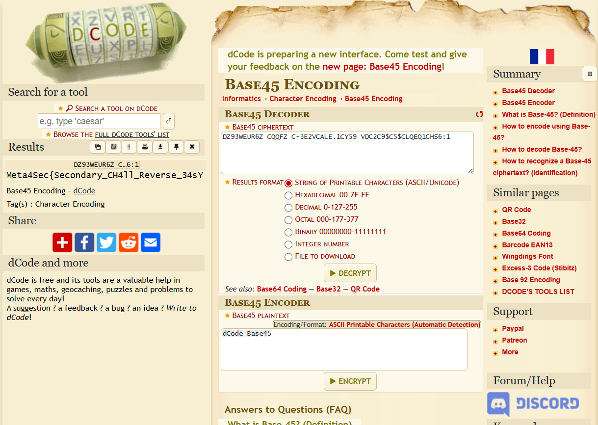

> Just basic Reverse Engineering

by `zfernm`

---

We were given a file named `malware.bat`. However, upon inspecting it with the `file` command, it turned out to be a Python compiled file (`malware.pyc`).



Initially, I was confused because there didn’t seem to be anything useful when reading the file directly. Eventually, I noticed a variable named `secret`. The value of this variable was:

```
DZ93WEUR6Z CQQFZ C-3E2VCALE.1CY59 VDC2C9$C5$CLQEQ1CHS6:1
```

Out of curiosity, I input this string into a cipher identifier tool.



The tool identified the encoding as Base45.



After decoding it, we obtained the flag.

To further confirm, I used PyLingual to decompile the `.pyc` file. Initially, PyLingual had a queue, but after the event ended, the queue cleared, and I was able to use it directly. The decompiled code can be viewed here: [PyLingual Decompiled Code](https://pylingual.io/view_chimera?identifier=9c33c29d8a92057d3b994469e22fbc2bc6ba148744194e62d098c3ac8914dd2a).

Here is the decompiled Python code:

```py
# Decompiled with PyLingual (https://pylingual.io)
# Internal filename: chall.py
# Bytecode version: 3.10.0rc2 (3439)
# Source timestamp: 2025-07-31 16:01:13 UTC (1753977673)

import tkinter as tk
from tkinter import messagebox
secret = 'DZ93WEUR6Z CQQFZ C-3E2VCALE.1CY59 VDC2C9$C5$CLQEQ1CHS6:1'

def greet_user():
    user_name = name_entry.get()
    if user_name.strip() == '':
        messagebox.showerror('Error', 'Nama tidak boleh kosong!')
    else:
        messagebox.showinfo('Selamat', f'Selamat datang, {user_name}!')
root = tk.Tk()
root.title('Selamat Datang')
name_label = tk.Label(root, text='Masukkan Nama:')
name_label.pack(pady=20)
name_entry = tk.Entry(root, width=40)
name_entry.pack(pady=5)
greet_button = tk.Button(root, text='Submit', command=greet_user)
greet_button.pack(pady=10)
root.mainloop()
```

As expected, the decompiled code confirmed the presence of the `secret` variable, and the rest of the code was just a simple GUI application.
