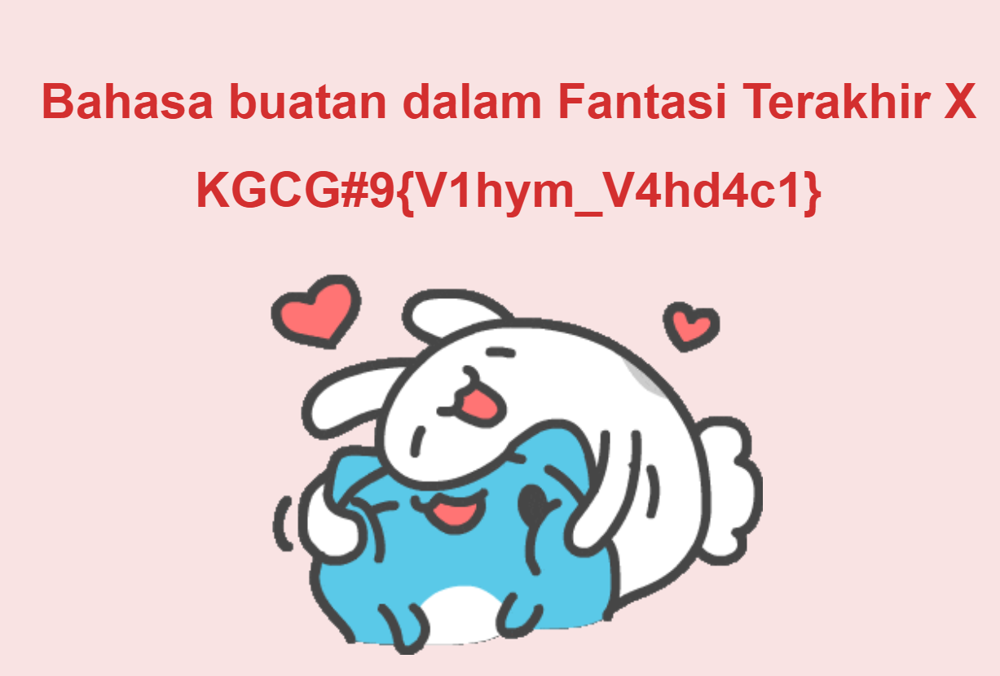
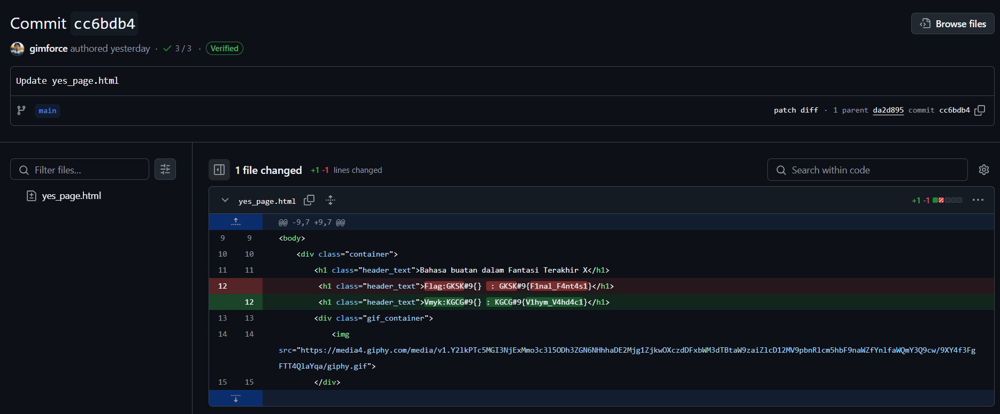

> Ayoo tunjukkan bakat kalian! Kunjungi alamat web https://gimforce.github.io/
> kalau kalian jago hacking

by `Keith`

---

Di halaman utama, kita bisa melihat ada dua tombol, yaitu "Ya" atau "Tidak". Jika kita klik "Ya", maka akan muncul sebuah halaman yang menunjukan seperti sebuah flag.

Teks itu seperti sebuah flag yang sudah diubah dengna menggunakan `ROT13`. Akan tetapi, jika kita coba untuk mengubahnya, tidak ada satupun yang cocok dengan format flag yang diberikan.

Dikarenakan website ini adalah sebuah website statis dan dihosting di GitHub Pages, maka kita bisa langsung untuk melihat source code website ini dengan mengunjungi [repository](https://github.com/gimforce/gimforce.github.io) dari website ini. Pada salah satu [commit](https://github.com/gimforce/gimforce.github.io/commit/cc6bdb43c9824aaaa3c05462d73a9d1eaa6a3331), kita bisa menemukan perubahan yang menarik pada halaman `yes_page.html`. Pada halaman tersebut, kita bisa melihat ada sebuah flag yang kita cari.

Sebenernya flagnya ini di terjemahkan ke dalam bahasa `Al Bhed` sesuai dengan clue yang diberikan yaitu "Bahasa buatan dalam Fantasi Terakhir X". `Al Bhed` adalah bahasa buatan yang digunakan dalam game **Final Fantasy X**.
