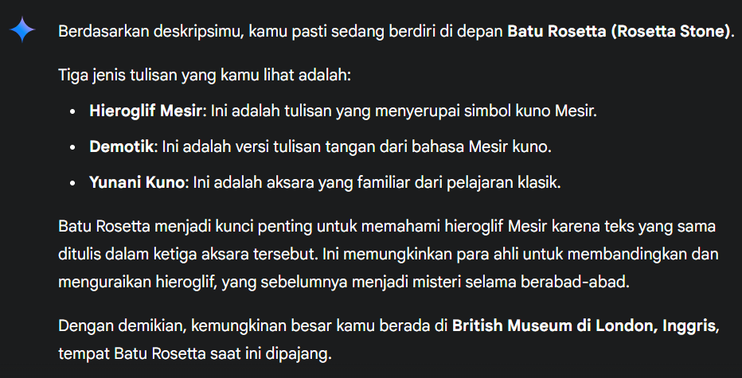

> Aku berdiri di depan sebuah batu besar dengan permukaan gelap dan kasar, penuh dengan tiga jenis tulisan yang berbeda. Satu aksara terlihat familiar dari pelajaran klasik, satu lagi menyerupai simbol kuno Mesir, dan yang terakhir tampak seperti versi tulisan tangan dari yang pertama. Batu ini telah lama dianggap sebagai kunci penting yang membuka pemahaman terhadap tulisan hieroglif. Jika kamu berhasil mengenali batu ini dan memahami arti dari ketiga aksaranya, kemungkinan besar kau tahu di mana aku berada saat itu.
>
> Format flag `GKSK#9{Nama_Tempat}`

by `kayloovi`

---

Dengan menggunakan Gemini AI, kita bisa mendapatkan informasi mengenai batu besar tersebut.

