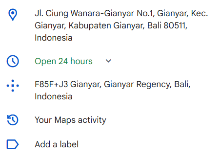

> Aku Mendapat foto patung dari temanku yang sedang berlibur, tapi aku tidak tau dimana lokasi patung tersebut. Dapatkanlah pluscode dari landmark lokasi patung tersebut.
>
> contoh format flag : `GKSK#9{4H45+788}`

by `morenokoprol`

---

Tinggal gunakan `exiftool` untuk mendapatkan metadata dari foto tersebut.

```bash
exiftool IMG20190203020554.jpg
```

Kita akan mendapatkan lokasi dari GPS yang ada di metadata tersebut.

```
GPS Latitude                    : 8 deg 32' 27.52" S
GPS Longitude                   : 115 deg 19' 22.04" E
```

Menggunakan [google maps](https://www.google.com/maps/place/Taman+Kota+Ciung+Wanara+Gianyar/@-8.5407343,115.3221572,19.38z/data=!4m6!3m5!1s0x2dd2165d83b5c8c3:0xb7143262946fe42b!8m2!3d-8.54091!4d115.3226862!16s%2Fg%2F11cn5pfxf8?entry=ttu&g_ep=EgoyMDI1MDUyMS4wIKXMDSoASAFQAw%3D%3D), kita bisa mendapatkan lokasi tersebut.


