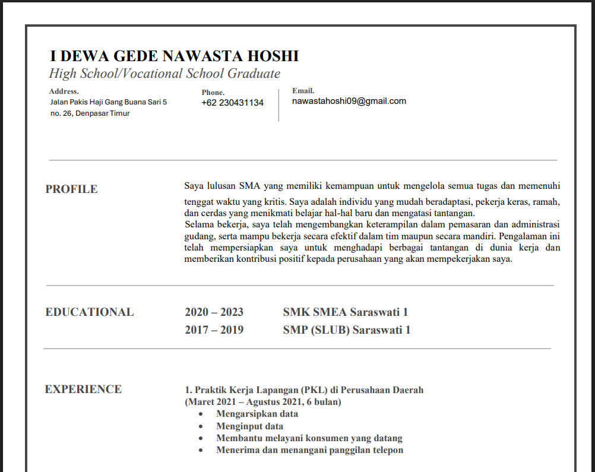
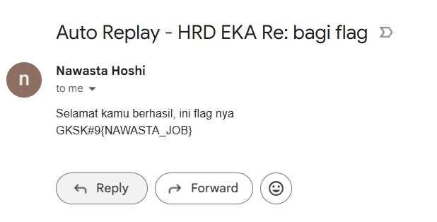

> Nawasta sudah lama berkerja dan sudah lelah dengan gaji umr. Bantu dia berbicara dengan HRD untuk kenaikan gaji!!
>
> Hint :
>
> -Coba analisis tempat kerjanya sekarang
>
> -Akan ada petunjuk untuk tahap selanjutnya

by `Nawasta`

---

Diberikan sebuah dokumen PDF yang berisi informasi tentang CV dan pengalaman kerja seseorang. Dokumen tersebut berisi informasi yang cukup lengkap, termasuk nama, alamat, nomor telepon, email, dan pengalaman kerja.

Setelah menganalisis dokumen tersebut, saya carilah tempat kerja yang pernah dia jalani. Tapi karena tidak menemukan informasi yang menarik, saya iseng untuk menghubungi email yang tertera di dokumen tersebut. Ternyata, email tersebut adalah sebuah email yang terdapat balasan otomatis yang akan mengirim flag yang kita cari.

Kepikiran buat kirim sesuatu ke alamat email karena waktu **RECURSION 1.0** saya juga buat soal mirip mirip begini yang dimana ada alamat email yang menggunakan balasan otomatis. (Dan yap kayaknya ini bukan intended solution)
