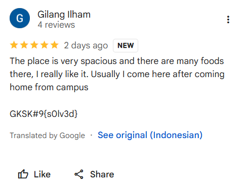

> Hari minggu siang, aku mengajak pacarku jalan-jalan ke mall setelah seminggu sibuk dengan kuliah dan pekerjaan. Kami memulai dengan makan siang di food court favorit, lalu berjalan-jalan sambil melihat sebuah aquarium yang berisi dengan ikan-ikan cantik. Kalian tau ga aku jalan jalan sama pacarku di mall mana?
>
> `Flagnya ada disana`

by `Keith`

---

Tinggal gunakan `exiftool` untuk mendapatkan metadata dari foto tersebut.

```bash
exiftool IMG_20250214_201629.jpg
```

Maka kita akan mendapatkan kordinat GPS dari foto tersebut.

```
GPS Latitude                    : 8 deg 38' 4.01" S
GPS Longitude                   : 115 deg 13' 54.52" E
```

Koordinat tersebut dapat kita masukkan ke dalam Google Maps untuk mengetahui lokasinya. Dan kita akan mendapatkan bahwa koordinat tersebut berada di sekitar area `Living World Denpasar`.

Pada salah satu reviews di Google Maps, kita akan menemukan sebuah komentar yang merupakan flag yang dimaksud.


