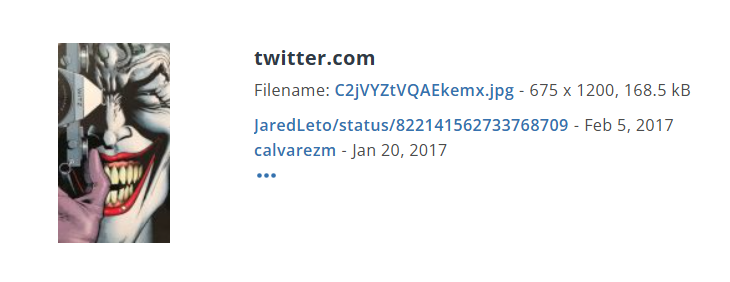
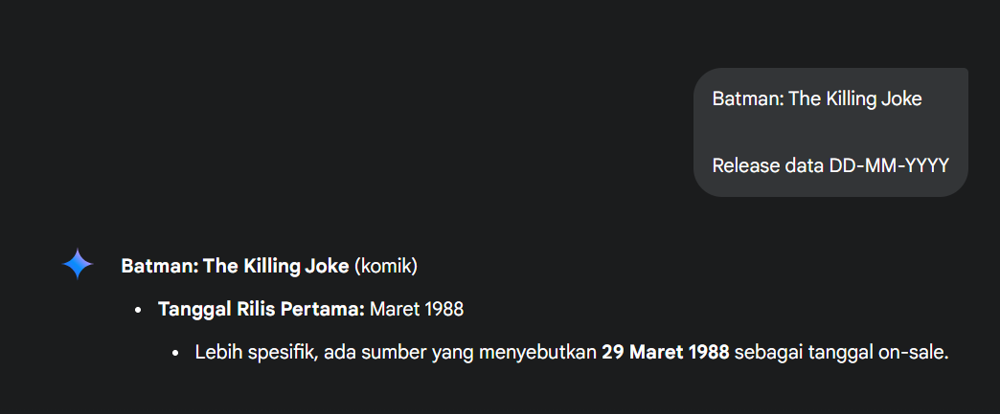

> kayloovi67 dikenal sebagai kolektor komik langka yang kerap membagikan koleksinya melalui media sosial. Dalam salah satu unggahannya, ia memperlihatkan cuplikan sampul komik, disertai caption: “Komik ini selalu berhasil membuatku tertawa... meski akhirnya begitu gelap. Kalau tau kapan cetakan pertamanya dijual, kamu kolektor sejati.”
>
> Flag: `GKSK#9{DD-MM-YYYY}`

by `kayloovi`

---

Diberikan username `kayloovi67`, kita mencari tahu tentang dia di media sosial. Ternyata dia adalah seorang kolektor komik yang sering membagikan koleksinya di [Instagram](https://www.instagram.com/kayloovi67). Karena terdapat petunjuk bahwa dia mengunggah cuplikan sampul komik, kita mencari unggahan yang relevan.

Kita menemukan sebuah [unggahan](https://www.instagram.com/p/DJ3H05TJCa0/) yang memperlihatkan sampul komik dengan caption yang menyebutkan "Komik ini selalu berhasil membuatku tertawa... meski akhirnya begitu gelap. Kalau tau kapan cetakan pertamanya dijual, kamu kolektor sejati."

Ketika kita reverse image search gambar tersebut menggunakan [TinEye](https://tineye.com/search/e7c0314abee95dd4f4c773b2a005ac7c7c0d427e?sort=score&order=desc&page=1).

Kita menemukan foto keseluruhan sampul komik tersebut. Dari sini, kita bisa melihat judul komiknya yaitu "Batman: The Killing Joke".

Dengan menggunakan Gemini AI untuk mencari tahu kapan cetakan pertama komik ini dijual, kita menemukan bahwa komik ini pertama kali diterbitkan pada 29 Maret 1988.

