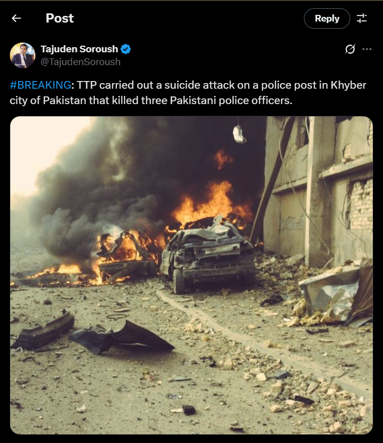
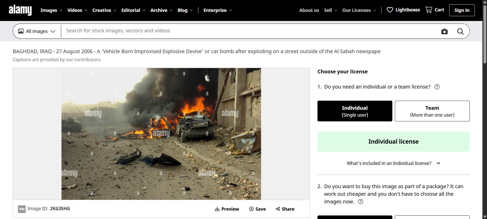

> Seorang jurnalis dengan 140 ribu followers di X mengunggah foto mobil yang hancur dan mengeluarkan asap yang banyak dan api, dengan tweet menyatakan : “BREAKING: TTP carried out a suicide attack on a police post in Khyber city of Pakistan that killed three Pakistani police officers.“ pada January 19, 2023.
>
> Foto ini bukanlah peristiwa yang di jelaskan oleh jurnalis.
>
> 1. Buktikanlah pernyataan diatas!
>
> `Format Flag : GKSK#9{NEGARA_KOTA_TANGGAL(/)_SINGKATANALATBOM}`

by `EncounterFeitz`

---

Karena ini adalah sebuah tweet maka kita bisa langsung mencari isi dari tweet itu "BREAKING: TTP carried out a suicide attack on a police post in Khyber city of Pakistan that killed three Pakistani police officers." dan kita akan menemukan sebuah [tweet](https://x.com/TajudenSoroush/status/1616108524026617856?lang=en), tapi sepertinya ini bukan tweet yang ada pada screenshot itu.

Langsung saja kita reverse image search dengan menggunakan [TinEye](https://tineye.com/search/07b288b4dd99644736909b67382fcf6eeb4171c3?sort=score&order=desc&page=1), pada list pertama kita akan menemukan website dari [alamy](https://www.alamy.com/baghdad-iraq-27-august-2006-a-vehicle-born-improvised-explosive-devise-or-car-bomb-after-exploding-on-a-street-outside-of-the-al-sabah-newspape-image491795068.html).

