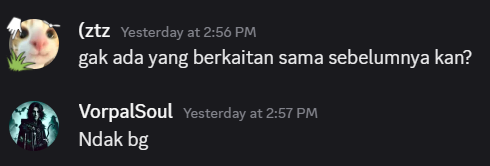
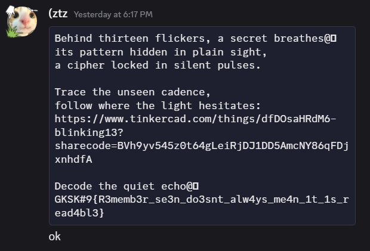

> Sebuah video berdurasi pendek ditemukan terkunci dalam akun Zoom milik **Eris**—sebuah akun usang yang tak pernah disentuh selama lebih dari tiga tahun. Tidak ada suara. Hanya kilatan cahaya samar, frekuensi visual acak, dan sebuah sensasi aneh yang tak bisa dijelaskan.
>
> Beberapa yang menontonnya bersumpah merasakan sesuatu… **menatap balik**.
>
> Rekaman itu sempat muncul sekilas di salah satu node tersembunyi di darknet—aktif selama 47 menit, lalu hilang tanpa jejak.
> Semua backup, cache, dan mirror... menghilang.
> Semua, kecuali satu.
> **Salinan yang kini ada di tangan Anda.**
>
> Di video itu tersembunya satu kalimat, ditulis dalam gaya khas Eris:
>
> > They think silence means absence. It never does.

by `VorpalSoul`

---

Karena udah gak mood sama ini soal jadi saya jelasin pakai kata-kata aja, intinya kita `binwalk` ini file (saya sama temen saya malah coba untuk mecahin qrcode sampai saya bruteforce karena probsetnya kelupaan "g" pada akhir linknya). Nanti ada file audio yang kalau kita buka dengan audacity dan melihat spectrogramnya, kita bisa lihat flagnya di situ.

Mau ngeluh dikit buat `MISSING 02` kata probset gak berhubungan ke soal sebelumnya dan malah dibikin bingung ternyata dimensi yang dimaksud adalah soal pada `MISSING 00` ini. Even kita udah dapat websitenya sebelum dikasih hint.

Kita solve pas probsetnya kasih tau kalau itu dimensi dari gambar `MISSING 00`. Kalau probsetnya gak bilang gitu kita dari awal udah solve sebelum selesai.

