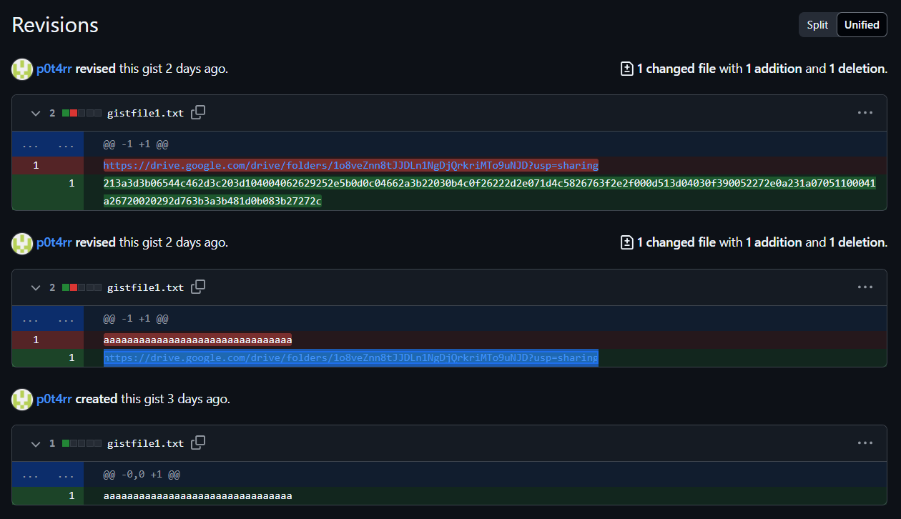

> A few days before he disappeared, a UI designer sent a project drawing to the security team, accompanied by a strange note: “Three cards appear in my dreams, The Magician, The Moon, and The Hermit. The letters dance, but only if you know which string to pull.” The drawing holds several clues. Some seem ordinary, but one of them records a trail that leads to a deeper communication, as if there is a hidden story behind it.
>
> The trail leads you to a hidden message. Not a sound, not an image, just a small movement captured by an old device. Can you follow the movement to the end?

by `p0t4rr`

---

We are provided with the file `chal.jpeg`. When examined with `binwalk`, we find that this JPEG file contains multiple embedded ZIP archives. To extract them, we can use the following command:

```bash
$ binwalk -e chal.jpeg                                   
```

The output indicates a number of ZIP files hidden inside the image, such as:

```bash
DECIMAL       HEXADECIMAL     DESCRIPTION
--------------------------------------------------------------------------------
...
46568         0xB5E8          Zip archive data, name: 2Uq7WhKZQ99JHfoXpNggwwygoYYR6oa0.log
...
95036         0x1733C         Zip archive data, name: VRQGTiKFbx9T3tBzZ6mawyN0Kj3mZPud.log
...
```

Among these extracted files is `VRQGTiKFbx9T3tBzZ6mawyN0Kj3mZPud.log`, which appears to contain HTTP access logs from a web server. A sample of its content includes:

```
...
192.168.1.200 - bob [09/May/2025:10:12:30 +0700] "GET /admin/login HTTP/1.1" 401 500 "-" "Mozilla/5.0 (Linux; Android 10; SM-G975F) AppleWebKit/537.36 (KHTML, like Gecko) Chrome/88.0.4324.152 Mobile Safari/537.36"
10.0.0.150 - - [09/May/2025:10:13:45 +0700] "GET /old_page.html HTTP/1.1" 301 250 "https://gist.github.com/p0t4rr/4d640e286632fa9827e14b8343738acf" "Mozilla/5.0 (iPad; CPU OS 14_4 like Mac OS X) AppleWebKit/605.1.15 (KHTML, like Gecko) Version/14.0.3 Mobile/15E148 Safari/604.1"
172.19.0.3 - - [09/May/2025:10:15:00 +0700] "PUT /api/resource/123 HTTP/1.1" 200 100 "-" "PostmanRuntime/7.26.8"
...
```

One notable request is to `/old_page.html`, which redirects to:
`https://gist.github.com/p0t4rr/4d640e286632fa9827e14b8343738acf`

Upon checking the Gist's revision history, we discover a Google Drive folder link:
`https://drive.google.com/drive/folders/1o8veZnn8tJJDLn1NgDjQrkriMTo9uNJD`
This folder contains a `.pcapng` file and an image of a drawing tablet.



After downloading the PCAP file, we observe numerous packets which seem to originate from a graphics tablet. We can extract the raw HID data using `tshark`:

```bash
tshark -r challenge.pcapng -T fields -e usbhid.data > out.txt
```

To convert this output into a usable format (Python tuples), we utilize CyberChef with the following recipe:
`https://gchq.github.io/CyberChef/#recipe=Fork('%5C%5Cn',',',false)Find_/_Replace(%7B'option':'Regex','string':'%5E(..)(..)(..)..$'%7D,'(0x$1,%200x$2,%200x$3)',true,false,true,false)&ieol=CRLF&oeol=CR`

The data represents mouse movement events with each tuple being:

```python
(left_button_pressed, x_offset, y_offset)
```

Based on a write-up from NSEC CTF 2021 (`https://res260.medium.com/usb-pcap-forensics-graphics-tablet-nsec-ctf-2021-writeup-part-2-3-9c6265ca4c40`), and with adjustments for our case, we use this Python script to simulate the movements and draw the output:

```py
from PIL import Image

mouse_events = [
    (0x00, 0xff, 0xff),
    (0x00, 0xfb, 0xff),
    (0x00, 0xfd, 0x00),
    ...,
    (0x00, 0x00, 0x00)
]

img = Image.new('RGB', (10000, 10000), color='white')
canvas = img.load()

mouse_x = 5000
mouse_y = 5000

for data in mouse_events:
    left_button_pressed = data[0] & 0x01
    x_offset = int.from_bytes(bytes([data[1]]), "big", signed=True)
    y_offset = int.from_bytes(bytes([data[2]]), "big", signed=True)

    mouse_x += x_offset
    mouse_y += y_offset

    if left_button_pressed:
        for i in range(5):
            for j in range(5):
                canvas[mouse_x + i, mouse_y + j] = (0, 0, 0)

img.save("final.png")
```

After running the script, we generate the image `final.png`, which reveals a hidden drawing or message:


