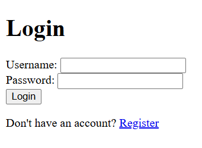
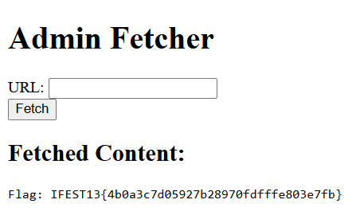

> This is my first time making a website using Python!!!! :D 
> http://103.163.139.198:12312

by `daffainfo`

---

In this challenge, we have access to a web application that allows login and registration. Since the source code was provided, we can start by analyzing it to understand the vulnerabilities.



## Vulnerability Discovery

The key vulnerability here lies in how the `/internal` endpoint is protected. According to the code, it restricts access to the IP address `127.0.0.1` (localhost), meaning only requests coming from the server itself can access this endpoint:

```python
@app.route('/internal')
def internal():
    if request.remote_addr != '127.0.0.1':
        abort(403)
    return "Flag: IFEST13{fake_flag}"
```

However, there is another endpoint, `/admin/fetch`, which is intended to be used by admins. This endpoint allows users to input a URL, and the server fetches the contents of that URL. If the URL contains `daffainfo.com`, it will be fetched successfully.

```python
@app.route('/admin/fetch', methods=['GET', 'POST'])
def admin_fetch():
    if 'user_id' not in session:
        return redirect('/login')

    user = db.session.get(User, session['user_id'])
    if user.is_admin != '1':
        return "You are not authorized.", 403

    result = None
    if request.method == 'POST':
        url = request.form.get('url')

        if 'daffainfo.com' not in url:
            result = "Error: Only URLs with hostname 'daffainfo.com' are allowed."
        else:
            try:
                resp = requests.get(url, timeout=5)
                result = resp.text
            except Exception as e:
                result = f"Error fetching URL: {str(e)}"
```

We notice that `daffainfo.com` is hardcoded as the allowed domain, and the URL entered by the user must contain this string. However, the check is not strict enough, as it allows us to input `http://127.0.0.1:1337/internal?daffainfo.com`, which will bypass the restriction and access the `/internal` endpoint.

## Registering as Admin

Another vulnerability is that the registration endpoint allows user data to be inserted directly into the database:

```python
@app.route('/register', methods=['GET', 'POST'])
def register():
    if request.method == 'POST':
        data = request.form.to_dict()
        
        data['password'] = hash_password(data['password'])

        user = User(**data)
        db.session.add(user)
        db.session.commit()
        
        return redirect('/login')
    return render_template('register.html')
```

In this case, there is no validation or restriction on setting the `is_admin` field when a user registers. By manipulating the registration form, we can set `is_admin = 1` for our user, which gives us admin privileges. Once we register as an admin and log in, we gain access to the `/admin/fetch` endpoint and can retrieve the flag using the previously crafted URL.


