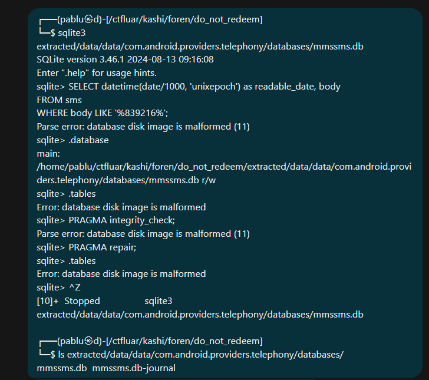
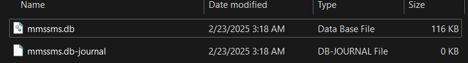
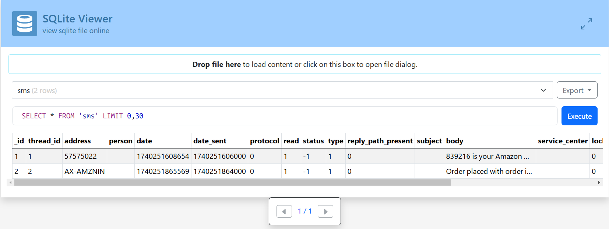

> Uh oh, we're in trouble again. Kitler's Amazon Pay wallet got emptied by some scammer. Can you figure out the OTP sent to kitler right before that happened, as well as the time (unix timestamp in milliseconds) at which kitler received that OTP?

Flag format: `KashiCTF{OTP_TIMESTAMP}`, i.e. `KashiCTF{XXXXXX_XXXXXXXXXXXXX}`

Download kitler's-phone.tar.gz
Mirrors:

https://gofile.io/d/edmDCj
https://storage.googleapis.com/chall-storage/kitler's-phone.tar.gz
GDrive
https://limewire.com/d/10d200d2-f55c-446e-9f2b-82bb81f38a84#w-sotKaYWiawMRljM_R78scaItljuNBK88sz90NWpZU
Verify the checksum

```sh
$ sha256sum kitler\'s-phone.tar.gz
5ce7e5047c54ce6ec145508ed6a4aecc237c41b86ea61e7e2991e9a8ed05142a  kitler's-phone.tar.gz
```

by `savsch`

---

So they give us a tarball with the name `kitler's-phone.tar.gz`. Let's extract it and see what we have.

```sh
$ tar -xvf kitler\'s-phone.tar.gz
```

After extracting the tarball, we get a directory named `kitler's-phone`. Inside the directory, is **Android's** root filesystem. 

My teammate had already attempted to extract the database files from the phone but was unable to open them.



After analyzing the directory structure, we located the relevant database file at:

```
/data/data/com.android.providers.telephony/databases
```



To access the SMS messages, we copied the database file from the location above.

To easily inspect the database contents, we uploaded the file to an online SQLite viewer:

[inloop.github.io/sqlite-viewer/](https://inloop.github.io/sqlite-viewer/).



The `sms` table contains two crucial columns:

- `date`: Stores the timestamp of when the SMS was received (Unix timestamp in milliseconds).
- `body`: Contains the text of the SMS message.

From this, we can extract the OTP message and its corresponding timestamp.
