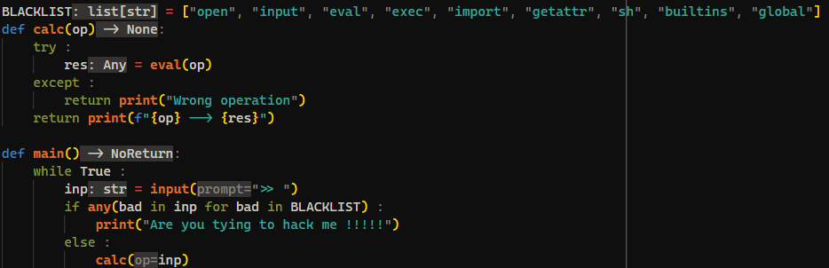

> I made a completely secure calculator this time.

---

Similar to the previous question [Easy Jail](#easy-jail), we are given a zip file that when extracted contains a `chall.py` file. This file is a simple calculator that asks for input from the user and evaluates that input.

From the source code we can see that the input given by the user will be evaluated using the `eval` function. Since the `eval` function evaluates the input given by the user, we can perform `code injection` to get the flag. However, there are some restrictions given to this problem, namely we cannot use keywords such as `os` and `system`.

Payload to get the flag: `().__class__.__bases__[0].__subclasses__()[134].get_data(".", "/flag.txt")` where `134` is the index of the `frozen_importlib_external.FileLoader` module in the list of subclasses.
