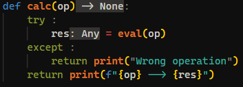

> I made this calculator. I have a feeling that it's not safe :(

---

Given a `zip` file when extracted there is a `chall.py` file. The file is a simple calculator that asks for input from the user and evaluates that input.

From the source code we can see that the input given by the user will be evaluated using the `eval` function. Since the `eval` function evaluates the input given by the user, we can do `code injection` to get the flag.

Payload to get the flag: `__import__('os').system('cat /flag.txt')`.
