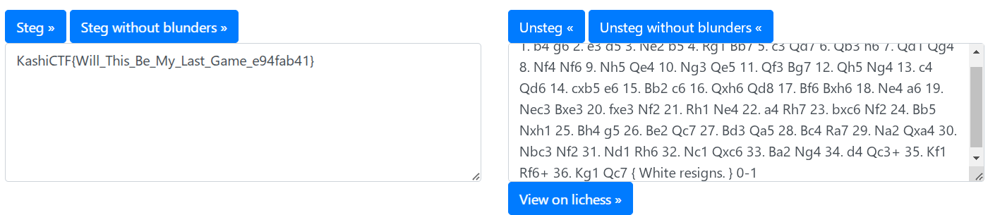

> We searched his room and found chess pieces thrown here and there ..thankfully someone recorded the entire game
>
> https://lichess.org/incUSy5k

---

To solve the challenge, we first visit the given **Lichess game** and download the **PGN** file by selecting "Download" -> "Portable Game Notation (PGN)." Once we have the PGN file, we use the [Chess Steganography Tool](https://incoherency.co.uk/chess-steg/) to extract hidden data. Uploading the PGN file to the tool and clicking "Extract message" reveals the hidden text within the game.

